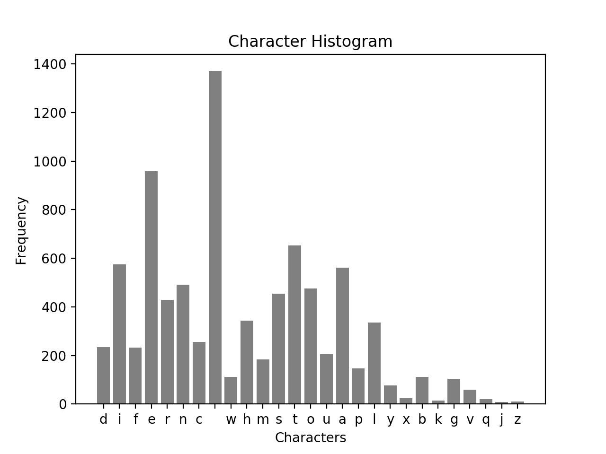
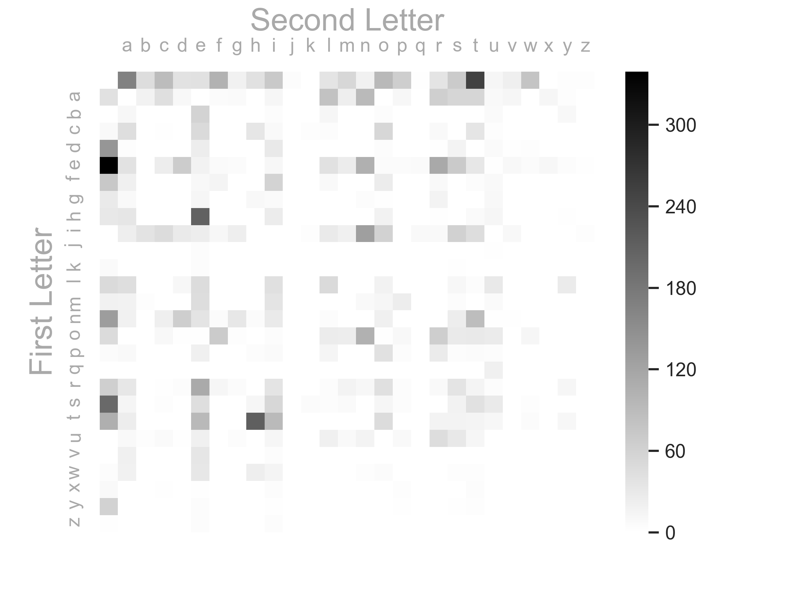
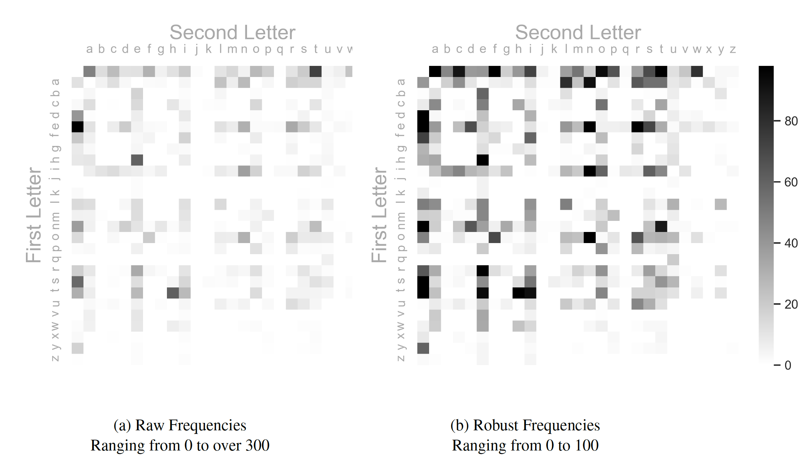

## Introduction

I have separated my work into sections so ease of flow. All Python code is included in this article. Observations of the data are shown in the histogram and heatmap below.

<hr>

## Header

The header of my python file gives general information:

```python
Title: Python Character Analysis
Author: Eric Pena
Date: Oct. 2019

Text Source:
Academic Sample
http://www.thegrammarlab.com/?nor-portfolio=1000000-word-sample-corpora
```

<hr>

## Packages
Below are important packages that I am importing for the program to work properly.

```python
import pandas as pd
import fileinput as fi
import matplotlib.pyplot as plt
import seaborn as sns
import string
```

<hr>

## User Defined Functions
I have defined several functions used by the \verb|main()| function:

```python
def read(file):
	"""Reads given file and parses characters

	Args:
		file: the text file to be parsed
	Returns:
		charArr: parsed character array
	"""
	return [i for line in fi.input(file) for i in line]

# -------------------------------------------------------------------

def count(array):
	"""Counts characters and creates freq table

	Args:
		array: character array of text
	Returns:
		freq: dictionary that represents freq table
	"""
	return {c: array.count(c) for c in array}


# -------------------------------------------------------------------


def partition2(array):
	"""Works similar to Mathematica's partition function
		but slightly differently. This function will create
		a string that combines each pair of characters in
		order to be hashed through by the count function.

	Args:
		array: this array
	Returns:
		
	"""
	return [str(array[i]) + str(array[i + 1]) for i in range(len(array) - 1)]
# -------------------------------------------------------------------


def dict_print(d):
	"""Print function specifically for dictionary

	Args:
		d: dictionary
	Returns:
		None: only prints out the contents of the dictionary
	"""
	[print(key[0] + ' --- ' + key[1] + ' :\t' + str(val)) for key, val in d.items()]

# -------------------------------------------------------------------


def to_dataframe(d):
	"""converts the dictionary of transitions to a dataframe from which
		can be turned into a heatmap

	Args:
		d: dictionary
	Returns:
		df: dataframe 
	"""
	# :: Create dataframe
	df = pd.DataFrame(columns=('First', 'Second', 'Frequency'))

	# :: Initialize matrix
	alpha = list(string.ascii_letters)[:26]
	alpha.append(' ')
	for i in alpha:
		for j in alpha:
			df = df.append(pd.Series([i, j, 0], index=df.columns), ignore_index=True)

	# :: Pivot our dataframe to make a matrix for heatmap
	df = df.pivot("First", "Second", "Frequency")

	# :: Add relevant frequencies to the matrix
	for k in d:
		df[k[1]][k[0]] = d[k]

	df = df[df.columns].astype(int)

	return df
# -------------------------------------------------------------------


def show_heatmap(df, filename):
	"""Create and plot heatmap of data

	Args:
		df: dataframe of frequencies
	Returns:
		None: Instead will plot a heatmap of the data
	"""
	# :: Creae heatmap and customize
	sns.set()
	ax = sns.heatmap(df, cmap="binary", robust=True, xticklabels=True, yticklabels=True)
	ax.xaxis.set_label_position('top')
	ax.xaxis.set_ticks_position('top')
	ax.spines['top'].set_visible(False)
	ax.tick_params(top=False, left=False)
	ax.xaxis.label.set_color('darkgray')
	ax.yaxis.label.set_color('darkgray')
	ax.tick_params(axis='x', colors='darkgray')
	ax.tick_params(axis='y', colors='darkgray')
	plt.xlabel('Second Letter', fontsize=18)
	plt.ylabel('First Letter', fontsize=18)
	plt.show()

	figure = ax.get_figure()
	figure.savefig(filename, dpi=400)
```

<hr>

## Main Program
This shows the code for the main program which utilizes the functions above.

```python
def main():
	# ---------------------------MAIN PROGRAM---------------------------
	# :: Reads in text file
	# :: Counts the frequencies
	# :: Data stored in dictionary
	# :: Plots histogram of results
	
	freq_dict = count(read('text.txt'))
	plt.bar(freq_dict.keys(), freq_dict.values(), color='gray')
	plt.title('Character Histogram')
	plt.xlabel('Characters')
	plt.ylabel('Frequency')
	plt.show()

	# :: Reads in text file
	# :: Partitions in 2-tuples for transitions
	# :: Data stored in dictionary
	# :: Frequencies are printed to console/terminal
	
	dict_print(count(partition2(read('text.txt'))))

	df = to_dataframe(count(partition2(read('text.txt'))))
	print(df)
	
	filename = '/Users/ericpena/iCloud/Binghamton_Courses/500_Computational_Tools/HW2/heatmap.png'
	show_heatmap(df, filename)

if __name__ == '__main__':
	main()
```

## Plot of Histogram


Figure 1 — Histogram that shows frequencies of characters appearing in the text

## Histogram Observations

Here are a few observations about the histogram above:

* $space\ character$: The space character is by far the most frequent. This makes sense since after each word, a space appears
* ${j, z, x, k}$: Characters such as $j$, $z$, $x$, and $k$ are low frequency --- not often present in common words
* $vowels$: It makes sense for the frequency of the vowels to be higher than consonants given how English is structured

## Heatmap of Character Transitions

The heat map below visually represents the frequencies of the transitions $c_i \rightarrow c_{i+1}$ where $c_i$ is the $i^{th}$ character in the supplied text file.


Figure 2 — Heatmap that shows the frequencies of character transitions

#### Heatmap Observations

Here are a few observations about the heatmap above:

* $Common\ Occurences$: Some common occurrences: $t \rightarrow h$, $i \rightarrow n$, $n \rightarrow t$, $r \rightarrow e$, $t \rightarrow i$
* $Spaces$: As expected the row and column of the $space$ is quite active --- this makes sense since all words start and end with a $space$
* $Bare$: It's interesting but not unexpected that the right bottom right is quite bare --- very low frequencies later in the alphabet

## Robustness Parameter

The heatmap above is actually using a `robust=True` parameter that normalizes the frequencies into a small range in order to improve the visualization. This is an improvement over the heatmap with the original frequencies. See below for the difference between the $RAW$ heatmap and the $ROBUST$ heatmap. More visual information can be obtained by using the $robust$ parameter since the `interesting' events are much more pronounced.


Figure 3 — Shows the difference between the Raw and Robust frequencies for the heatmap

## Appendix — Output Data

<hr>

#### Histogram Frenquencies

\{'d': 234, 'i': 574, 'f': 233, 'e': 958, 'r': 428, 'n': 492, 'c': 255, ' ': 1370, 'w': 111, 'h': 344, 'm': 184, 's': 455, 't': 653, 'o': 475, 'u': 206, 'a': 561, 'p': 146, 'l': 336, 'y': 77, 'x': 24, 'b': 111, 'k': 15, 'g': 103, 'v': 60, 'q': 20, 'j': 9, 'z': 11\}

#### Heatmap Frenquencies
d --- i :	30
i --- f :	11
f --- f :	15
f --- e :	10
e --- r :	114
r --- e :	113
e --- n :	105
n --- c :	22
c --- e :	49
e ---   :	339
  --- w :	79
w --- h :	23
h --- e :	210
  --- m :	53
m --- c :	1
c ---   :	8
  --- i :	72
i --- s :	61
s ---   :	199
  --- t :	252
t --- h :	212
m --- o :	13
o --- i :	5
s --- t :	41
t --- u :	11
u --- r :	46
  --- c :	90
c --- o :	54
o --- n :	104
n --- t :	88
t --- e :	94
t ---   :	107
m --- a :	18
a ---   :	40
a --- s :	55
s --- s :	18
  --- o :	93
o --- f :	70
f ---   :	73
  --- s :	69
s --- a :	14
a --- m :	23
m --- p :	25
p --- l :	14
l --- e :	47
  --- a :	168
a --- f :	6
f --- t :	4
r ---   :	64
  --- h :	40
h --- u :	12
u --- m :	9
m --- i :	37
i --- d :	28
i --- t :	46
t --- y :	11
y ---   :	60
  --- e :	40
e --- x :	11
x --- p :	3
p --- o :	41
o --- s :	28
s --- u :	28
a --- n :	92
n --- d :	65
d ---   :	140
m --- d :	1
  --- d :	39
d --- r :	2
r --- y :	12
  --- r :	37
e --- s :	71
u --- l :	21
l --- t :	4
t --- s :	17
s --- c :	3
c --- u :	3
u --- s :	31
s --- i :	53
i --- o :	60
n ---   :	131
c --- h :	34
e --- m :	26
i --- c :	47
c --- a :	45
a --- l :	81
l ---   :	50
o --- m :	24
t --- i :	92
  --- f :	103
f --- i :	59
i --- b :	38
b --- e :	59
r --- s :	37
w --- e :	33
e --- l :	40
l --- l :	49
  --- k :	1
k --- n :	1
n --- o :	21
o --- w :	12
w --- n :	3
h --- a :	34
a --- t :	55
  --- l :	37
l --- i :	42
i --- g :	23
g --- n :	4
o --- c :	10
l --- u :	30
l --- o :	18
i --- n :	128
n --- v :	2
v --- e :	34
g --- a :	8
e --- d :	68
o --- u :	27
u --- n :	17
n --- e :	37
  --- q :	2
q --- u :	20
u --- a :	8
i --- e :	24
d --- o :	5
o --- e :	2
  --- n :	19
o --- t :	30
a --- d :	10
d --- d :	1
  --- u :	12
u --- p :	9
p ---   :	6
t --- o :	47
o ---   :	48
i --- m :	21
l --- y :	27
  --- b :	46
e --- c :	25
a --- u :	9
s --- e :	44
n --- l :	4
a --- j :	1
j --- o :	1
o --- r :	66
a --- r :	64
e --- p :	6
r --- t :	15
d --- e :	24
e --- t :	32
r --- m :	17
  --- p :	66
p --- e :	20
c --- t :	35
p --- r :	27
r --- o :	42
e --- i :	11
n --- s :	24
x --- t :	4
t --- r :	17
r --- a :	32
a --- c :	43
t --- a :	24
a --- b :	18
b --- l :	12
r --- g :	6
n --- i :	28
t --- t :	15
u --- c :	7
h ---   :	31
w --- a :	19
a --- x :	12
x --- e :	2
f --- a :	20
l --- c :	1
o --- h :	1
h --- o :	18
o --- l :	26
l --- s :	11
c --- i :	8
d --- s :	16
i --- l :	28
l --- a :	44
r --- l :	5
e --- q :	7
u --- e :	20
a --- p :	11
p --- p :	4
o --- x :	1
x ---   :	9
w --- t :	3
h --- i :	26
  --- g :	19
g --- o :	2
o --- o :	2
o --- d :	2
a --- g :	7
g --- r :	16
e --- e :	18
m --- e :	46
  --- v :	22
v --- a :	20
b --- y :	10
e --- z :	2
z ---   :	2
n --- z :	1
z --- a :	1
f --- l :	8
a --- v :	12
g --- h :	10
b --- a :	11
r --- n :	11
n --- h :	6
s --- k :	6
k ---   :	7
e --- a :	39
r --- c :	2
g --- e :	13
u --- g :	5
g --- u :	10
u --- i :	13
e --- y :	5
n --- g :	33
g ---   :	29
f --- r :	9
m ---   :	19
r --- i :	36
e --- o :	6
o --- g :	3
p --- h :	4
e --- g :	6
g --- i :	7
o --- p :	10
r --- f :	13
s --- h :	13
w --- s :	3
h --- t :	7
a --- i :	13
w --- i :	15
s --- w :	3
x --- i :	4
m --- u :	7
d --- u :	7
i --- q :	9
p --- i :	7
i --- i :	1
i ---   :	1
e --- f :	7
p --- a :	9
c --- k :	3
k --- e :	5
e --- v :	10
f --- u :	9
b --- s :	1
s --- o :	13
r --- p :	4
p --- t :	6
m --- n :	8
f --- o :	26
n --- f :	6
d --- a :	3
i --- a :	23
h --- l :	1
i --- k :	3
n --- y :	1
n --- a :	19
r --- v :	1
l --- w :	1
a --- y :	3
y --- s :	2
v --- i :	5
r --- r :	8
s --- p :	5
i --- z :	3
z --- e :	4
o --- b :	1
b --- t :	1
i --- p :	1
y --- i :	2
i --- v :	10
c --- r :	9
c --- c :	2
g --- y :	1
  --- z :	3
z --- i :	4
s --- m :	7
c --- l :	4
p --- u :	4
t --- w :	6
m --- s :	5
b --- o :	5
l --- d :	11
b --- i :	4
p --- s :	4
b --- u :	7
u --- t :	12
h --- y :	2
y --- d :	1
i --- r :	8
c --- y :	1
g --- g :	1
a --- z :	1
n --- k :	1
y --- z :	1
l --- m :	1
  --- y :	3
y --- p :	2
x --- c :	2
r --- u :	4
u --- f :	1
d --- l :	1
o --- a :	1
s --- y :	1
y --- m :	1
o --- v :	1
d --- v :	2
u ---   :	1
  --- j :	5
j --- u :	2
y --- t :	3
a --- q :	1
y --- r :	1
g --- l :	1
w --- o :	6
r --- d :	5
u --- d :	2
u --- b :	3
y --- e :	4
u --- o :	1
m --- m :	1
e --- w :	6
w ---   :	5
s --- b :	1
g --- f :	1
m --- b :	3
a --- w :	1
a --- k :	1
b ---   :	1
n --- u :	2
k --- s :	2
n --- j :	1
j --- a :	1
s --- r :	1
a --- e :	1
j --- e :	5
a --- h :	1
r --- b :	1
o --- j :	1
e --- u :	2
v --- o :	1
s --- l :	4
h --- m :	1
h --- r :	2
d --- w :	3
w --- r :	1
e --- j :	1
s --- q :	1
