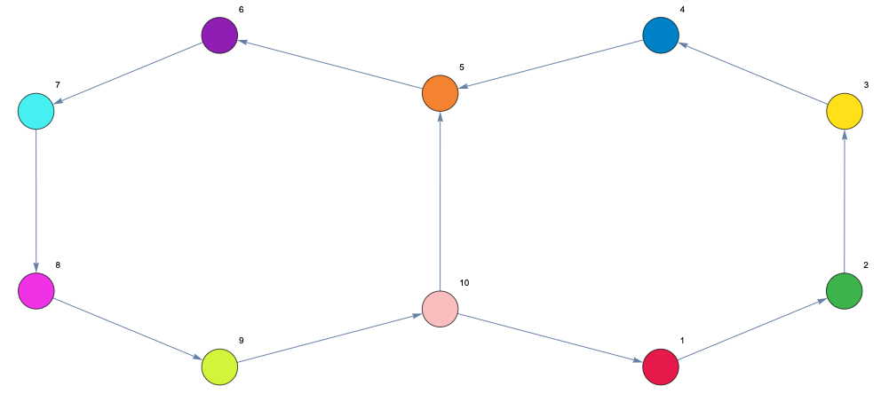

<!--  -->

---------------------------------------

Figure 1 — Directed Network Which Represents Threshold Linear Network

#### Adjacency Matrix Representing Directed Network

$$\begin{pmatrix} 0 & 1 & 0 & 0 & 0 & 0 & 0 & 0 & 0 & 0 \\\ 0 & 0 & 1 & 0 & 0 & 0 & 0 & 0 & 0 & 0 \\\ 0 & 0 & 0 & 1 & 0 & 0 & 0 & 0 & 0 & 0 \\\ 0 & 0 & 0 & 0 & 1 & 0 & 0 & 0 & 0 & 0 \\\ 0 & 0 & 0 & 0 & 0 & 1 & 0 & 0 & 0 & 0 \\\ 0 & 0 & 0 & 0 & 0 & 0 & 1 & 0 & 0 & 0 \\\ 0 & 0 & 0 & 0 & 0 & 0 & 0 & 1 & 0 & 0 \\\ 0 & 0 & 0 & 0 & 0 & 0 & 0 & 0 & 1 & 0 \\\ 0 & 0 & 0 & 0 & 0 & 0 & 0 & 0 & 0 & 1 \\\ 1 & 0 & 0 & 0 & 1 & 0 & 0 & 0 & 0 & 0\end{pmatrix}$$

$$\frac{d x_i}{dt} = -x_i + \left[ \sum_{j=1}^{n} W_{ij} x_j + \theta \right]_+ i = 1, \ldots, n$$

Figure 2 — Solution Via Numerically Solving Differential Equation

## Initial Conditions
The initial conditions applied to the network above are the following:

* $x1[0] = .9$
* $x2[0] = x3[0] = x4[0] = x5[0] = x6[0] = x7[0] = x8[0] = x9[0] = x10[0] = .5$

Figure 3 — Dynamics of Directed Network Which Represents Competitive Threshold Linear Network

<iframe src="https://docs.google.com/presentation/d/1fx30MNJ0vK8NCKlWVHHwYNCAWU1UkN1zVmRUMJ6gjVQ/edit?usp=sharing" frameborder="0" width="800" height="600" allowfullscreen="true" mozallowfullscreen="true" webkitallowfullscreen="true"></iframe>

