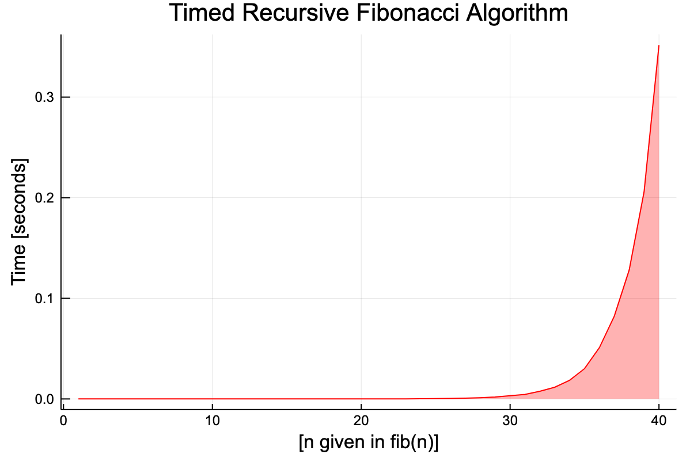
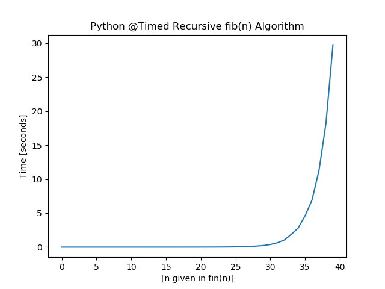
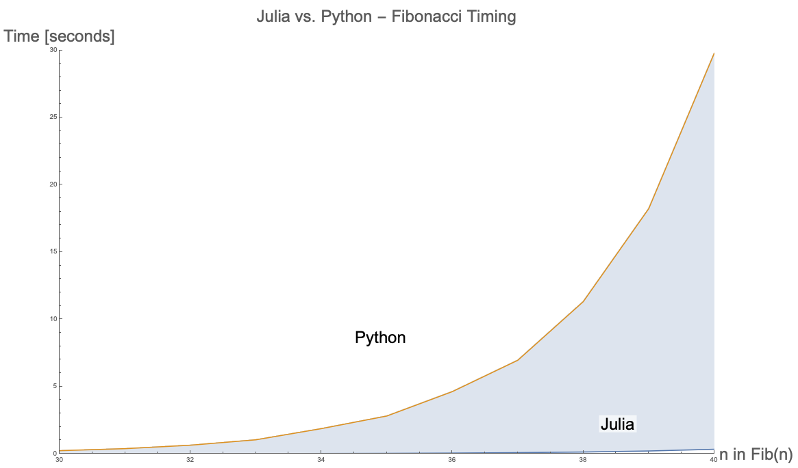

## Creating fib(n)

```python
function fib(n)
    if (n == 1 || n == 2)
        return 1
    else
        return fib(n - 1) + fib(n - 2)
    end
end
```

## Timing fib(n) 1:40
```python
function fibTime(k)
    t = []
    for i in 1:k
        push!(t, (@timed fib(i))[2])
    end
    return t
end

# :: Print @timed Fibonacci 1 through 40
println(fibTime(40))
```

## Plotting @Timed Results

The timing for Julia is surprisingly very fast!
```python
using Plots
plot(fibTime(40), title="Timed Recursive Fibonacci Algorithm", 
	color = :red, fill = (0, .3, :red), legend = false)
xaxis!("[n given in fib(n)]")
yaxis!("Time [seconds]")
```

<hr>


Figure 1 — Timed Recursive Algorithm That Calculates $n^{th}$ Fibonacci Number in Julia.

## Achieve Results in Python

```python
from matplotlib import pyplot as plt
import time

def fib(n):
    if (n == 1) or (n == 2):
        return 1
    else:
        return fib(n - 1) + fib(n - 2)

def fibTimed(k):
    t = []
    for i in range(1, k + 1):
        s = time.time()
        fib(i)
        fib_t = time.time() - s
        t.append(fib_t)
    return t

result = fibTimed(40)
print(result)
plt.plot(result)
plt.title("Python @Timed Recursive fib(n) Algorithm")
plt.xlabel("[n given in fin(n)]")
plt.ylabel("Time [seconds]")
plt.show()
```

<hr>

The results from Python are significantly slower than compared to Julia. $Fib(40)$ takes nearly $30$ seconds to complete.


Figure 2 — Timed Recursive Algorithm That Calculates $n^{th}$ Fibonacci Number in Python.

## Show Julia Versus Python Comparison

The plot below shows that Julia is significantly more efficient compared to Python for this recursive algorithm.

<hr>


Figure 3 — Timed Recursive Algorithm Between Julia and Python between $n = 30$ and $n = 40$