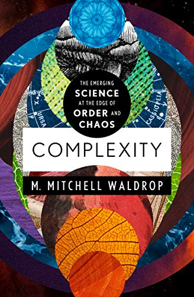

# Part I:

## Introduction
Providing the multifaceted story of how complex systems has evolved into what it is today is no easy feat. Dr. Melanie Mitchell not only gives a comprehensive historical tour of science and mathematics, she also provides foundational knowledge that any reader can carry to appreciate the essence of what it means for a system to be complex in the technical sense. Early on, she gives a clear definition of complex systems as an interdisciplinary field that studies how large networks of entities with no central controller can organize themselves and exhibit collective behavior given simple rules. However, she also humbly confesses that given how nebulous the field is, there has yet to be one clear definition of complexity that everyone can agree on. I appreciate how candid she is about what is known and what is not known in this field. Mitchell shares that even a panel she organized of great system science thinkers at the Santa Fe Institute could not agree on an answer to the question: "how do you define complexity?".

She acknowledges the potential skepticism that one might feel because of the nascence of this field. However, she encourages the reader by sharing fascinating real-world examples---such as ant colonies, brain activity, and internet networks---that show the ubiquity of complex systems and its necessity in understanding how systems evolve in our lives. She eloquently describes the emergent collective behavior that arises from these systems and the wide scale at which they occur. From thoughts and consciousness in the brain to global economic market movements, these can all be thought of as emergent phenomena attributed to complexity. She mentions that some have even call these systems superorganisms that exhibit a collective intelligence even in non-living, non-conscious systems. She borrows examples from economics stating that the self-interest of smaller economic entities such as companies and individuals create macroscopic effects that tend to not resemble the smaller systems at all. I appreciate that complex systems are not only accessible to all of us everywhere we are, but also require them to survive such as brain neuroactivity and heartbeat rhythms.

Given my background, the section on dynamics, chaos, and prediction resonated with me most. Mitchell beautifully tells the story of how the natural world was analyzed by great scientists in history and how our understanding of nature evolved. This historical account builds from Aristotle, Copernicus, Galileo, Kepler, and finally Isaac Newton and his revolutionary laws of motion. Newton established a concept of universality extending the natural laws from the terrestrial realm to celestial bodies---one of the most enlightening realizations in science.

When I consider physics paradigms in the context of complexity, I think about the dismantling of reductionism---where the notion that a system is the sum of its parts, as is the case in classical mechanics---is no longer valid. Mitchell does not talk much about reductionism directly but instead touches on a topic much richer on how concepts in physics directly led to the understanding of complexity and its causes. Much of physics is used primary to make predictions but Mitchell mentions two important scientific discoveries that make prediction very difficult: the uncertainty principle from quantum mechanics and the sensitivity of initial conditions from chaos theory. In 1927, Heisenberg taught us that the momentum and position of a particle cannot be known simultaneously but rather act as a trade-off of information. This is not an experimental limitation but an inherent limitation of information that is written into the law of physics. This must have been devastating during the time of Newton's "clockwork universe" when mathematicians such as Pierre Simon Laplace had ideas of being able to, in theory, predict everything at all times given we have the information to do so. The development of chaos theory by Poincar\'e and Lorenz had a similar effect stating that even the tiniest variation in initial conditions can lead to drastically different outcomes---which served as another blow to predictability.

Mitchell sheds hope and motivates the reader by mentioning that in the same way there are universal laws in physics, there are similar invariants in the study of complex systems as well. Period-doubling as a system evolves to a chaotic state and the Feigenbaum's constant for the rate at which bifurcations converge are examples of remarkable invariant properties in complex systems. This provides an indication that the essence of physics can likely be applied to the field of complex systems and even possibly toward its version of a unified theory.

## Information and Entropy
Dr. Melanie Mitchell seamlessly weaves together the concepts of information, entropy, energy, and thermodynamics. These are integral to the field so much so that she even refers to "entropy-defying self-organization" as the "holy grail of complex systems". She resolves the misconception that entropy can at times decrease without consequence even though the law of thermodynamics forbids it. She talks about this in terms of Maxwell's Demon stating that work is required for the demon to do its job. I had learned about Maxwell's Demon in the past but had never considered this in terms of information. Szilard thought that work and energy was expended when obtaining the measurements of the particle's velocities---in other words, it requires work to obtain the relevant information needed. I find this to be a novel idea and a clever way to connect all of these concepts in one easy to understand example.

## Computation
Another pivotal moment for me in reading Part I was in chapter 4---computation. In the same way that physics endured a disillusionment of endless predictability, mathematics and computability had a relatable event in history through the work of Kurt Gödel and Alan Turing. 
David Hilbert's provocative questions for the mathematics community challenged the stability of mathematics itself. Gödel figured out how to convert statements into mathematical language and learned that there exists self-contradictory mathematical statements---showing that not everything in mathematics could be proven. Mathematics was viewed as being exacting and able to prove anything at that time. Gödel's Incompleteness Theorem shattered the apparent grandeur of mathematics and worried many practitioners. Alan Turing also came up with a similar answer using what was called a Turing Machine. The result had extended to machine language as well.

Dr. Mitchell is not only able to clearly explain a topic as abstruse as complex theory, she does so to a general audience without inundating the reader with technical jargon. Since there is not a definition of complexity that the scientific community can agree on, Mitchell offers some thoughts about possible ways that complexity could be defined. She is again very candid about the limitations of these definitions and explains why they would not hold up in isolation. All throughout Part I, she keeps the theme of being informative, honest, and motivating. She is honest about scientists not yet having a clear understanding of the field but also offers other examples in history where this was also true such as the concept of energy before it was well understood. Even today, research on genes and dark matter have yet to be understood fully but are making tremendous progress. I learned a great deal so far from this book and I look forward to the insight it has to offer in the remaining chapters.

# Parts II and III

Melanie Mitchell states that it is hypothesized that the balance between exploration and exploitation of information may serve as a general property of what are now called complex systems. Having read parts II and III of the book, it is evident that this idea could not have been developed without the use of computation, particularly self-replicating systems. Mitchell takes us deeper into the journey of complex systems and focuses on the connection between computation and living systems. From the fine details of a genetic algorithm to large-scope philosophical ideas, she provides different levels of abstraction allowing the reader to appreciate these topics from all angles. The historical account she gives of evolutionary computation reads as if she is alluding to the past and the future almost simultaneously --- she tells where the inspiration has come from and where it could lead.

## Self Replication
Part II begins with the idea of ***what life is*** and what are its properties. Mitchell explains how the idea of self-replicating artificial life is an old idea but continues to live on, even in our movies and artwork today. I thought this was a great introduction to the idea of evolutionary programming. The discussion leads to the idea of reproduction of computer systems that can, for example, print their own code. This is a novel idea on a fundamental level and a great zeroeth-order example to begin understanding its significance; but the fact that DNA, for example, can actually transcribe its own interpreter may provoke one to admit: some systems actually are *living*.

## Genetic Algorithms
I was inspired by the chapter on genetic algorithms to create my own program---a simple program that evolves and learns to print the characters: 
**ericpena**. Although a simple task for a computer to perform, it made apparent the power of this methodology to solve more complicated tasks. John von Neumann is essentially the person who established the idea of self-replicating machines in a tangible way. Although, he thought that replication was not enough as these systems also need to evolve, learn, and compete with one another to survive. It was John Holland that proposed the idea for genetic algorithms that was inspired by how nature evolves to find near-optimal solutions via natural selection. Mitchell gives a great example on how a genetic algorithm can help improve the performance of Robby, the Soda-Can-Collecting Robot. This chapter revealed the vast potential for genetic algorithms and how in many ways they are better than human-developed algorithms for various tasks. One particular discussion that stood out to me regarding Robby is the following: Robby's success isn't necessarily dependent on the individual, step-by-step decisions that Robby makes to collect cans but rather the aggregate of these steps that define a hollistic strategy, a rather successful strategy at that. Mitchell explains this by stating that it isn't always individual genes at work but rather their interactions that produce results.

## Cellular Automata and The Nature of Computability
I have been enthralled by cellular automata ever since I first learned about them. In this chapter, Mitchell talks about how computation occurs in nature and what it even means for nature to "compute". Similar to the way in which physicists simplify problems to gain understanding---through frictionless slopes and spherical cows---scientists have performed a simplification for computation in the form of cellular automata. Although the rules of a cell can be relatively simple, the interconnectedness of a grid of cells can produce complex behavior that can, at times, simulate natural processes such as forest fires, fire flies, and even neurons. The field of cellular automata seemed to have taken a life of its own. John von Neumann, who played a key role in creating cellular automata, proved that it is actually Turing Complete. John Conway's Game of Life programs popularize the discipline even further especially when proving that his game is capable of simulating a universal computer. With the large number of configurations and possibilities, it may have been difficult to wrap one's head around the innate behavior of this mechanism. It was Stephan Wolfram, who nothing short of genius, worked diligently and cleverly to classify the ways in which cellular automata can behave and what patterns it can exhibit. He created libraries of patterns for these things, particularly four classes, and became rather popular for his book on them, {\it A New Kind of Science}. I learned about Wolfram during my undergraduate program and used Mathematica for many of my homework problems---although I had not read about his beliefs that Mitchell mentions in the reading. I found it interesting that Wolfram believes natural processes are intrinsically computable and can be explained in this way. While in physics, I conceded to the idea that nature is infinitely complex and our best hope in grasping it is to make very accurate approximations with efforts such as quantum mechanics or Einsteinian gravity. However, Mitchell explains that Wolfram believes that nothing can be more complex than a universal computer which forces an upper limit on the complexity that the universe can exhibit---this is very interesting although I am not sure I agree completely given the unpredictability we read about earlier in the book, particularly in quantum mechanical phenomena. I was nevertheless fascinated by these ideas and will revisit them in the future.

A connection became apparent to me while reflecting on the chapters on genetic algorithms and cellular automata.  On one hand, many processes in nature consists of simple rules but large in number that coalesce into complex behavior. Cellular automata has this idea built into its very structure. In a way, we can say that the mechanism by which nature evolves and produces complexity is comparable to the way in which cellular automata does so. On the other hand, genetic algorithms were inspired by what occurs in nature, namely natural selection and evolution. I found it fascinating that nature utilizes general principles found in cellular automata and that genetic algorithms mimic what is done in nature. This further reinforces the link between computation and living systems.

## Information Processing
Mitchell guides the reader in understanding information processing particularly in living systems. I enjoyed how she uses different levels of programming, high level and machine language, to home in on the concept of abstraction. She mentions that it's relatively easy to imagine how changes in high level code are translated into low level machine language since the tether between the two is tangible and somewhat predictable. She compares this to cellular automata where the ability to create a productive level of abstraction is not present. This is particular to cellular automata but I imagine that it is a limitation that can be applied to much of complex systems as a whole---this is, creating a high level framework from which many applications can benefit from especially biological applications.
The book wonderfully explains information processing both in terms of what information is and how it is processed. It accomplishes this with the help of three real-world examples: the immune system, ant colonies, and biological metabolism. One of my favorite parts---which Mitchell believes is a quite profound idea---is that on the {\it meaning} of information. We can think in terms of inputs and outputs but what does the information {\it mean} and what part of a system is doing this type of analysis? As Mitchell points out, this is particularly mysterious for systems with no central controller.

# Parts IV and V

Part IV of Melanie Mitchell's book discusses the science of networks---a topic in which tremendous progress and development has been made relatively recently. She begins the discussion with Harvard University psychologist, Stanley Milgram. He was one of the first to have devised an experiment designed to understand the degrees of separation in a network---his experiment is the quintessential example of the small world property in a network.

## Networks
Professor Mitchell introduces networks and gives examples that demonstrate that networks are ubiquitous in our everyday lives. From social networks to epidemiological studies, these fields can and should be explored in the context of network science. She mentions popular names in the network science world: Duncan Watts, Steven Strogratz, Albert-László Barabási, and Réka Albert who all published papers that formed the foundation of network science. She mentions that physicists made contributions to the field of network science, which is right in the physics wheelhouse given its mathematical nature and real-world application. Mitchell explains that physicists have been trained to simplify complex problems without losing their essential features. I did enjoy and will attempt to commit to memory the eloquent quote from Duncan Watts, "No one descends with such fury and in so great a number as a pack of hungry physicists, adrenalized by the scent of a new problem."

It is helpful to the reader to know generally what a network is. Mitchell explains the basics of in-degree, out-degree, and their distributions in a network. She goes into what clustering means and how we think about clustering in the real-world. She gives popular examples such as an airplane's use of hubs to optimize flight itineraries. If one were to create a network whose degree distribution is random, all nodes would have somewhat similar degree and the degree distribution would be considered uniform---unlike what we see in real-world biological and social networks. Naturally occurring networks exhibit hub structures and skewed degree distributions which is quite interesting. What invisible hand is fine-tuning these networks to acquire these specific properties? Mitchell gives us great insight on this. She breaks down the general attributes of networks into two pillars: small-world and scale-free. She explains that when a network has small-world-ness, it exhibits attractive features for a network to have such as robustness and faster communication. A skewed degree distribution makes a network robust to node deletion since hubs are few in number and high in degree. The Milgram experiment is a clear example of how these networks can benefit from efficient information spread whereas disease outbreaks may be exacerbated.

Network science was especially propelled by the use of computers: their increase in computing power and availability of data. Mitchell explains that although real-world networks resembled small-world structures, it was not exact. They are better explained by a property called scale-free that pervades mostly all natural networks. She gives an explanation of using Google's page-rank to show that the world wide web itself is a scale-free network. She goes on the talk about this in terms of scaling invariance and self-similarity and says that this is what is meant by scale-free---terms that are all synonymous. Another concept she equates to the scale-free property of networks is power law degree distribution. An important part of this discussion is Barab\'asi's work on preferential attachment and how this mechanism facilitates the scale-free structure in naturally forming networks.

It certainly does aide the reader in having stimulating real-world examples of network structures from which to explore these properties. The examples she delves into are the brain of the worm C. elegans, genetic regulatory networks in our bodies, epidemiological studies, and even ecological insights that the reader can learn from. Mitchell not only explains that the brain of a worm is found to have small-world structure, she also encourages the reader to consider a rather provocative question: "Why would evolution favor brain networks with the small-world property?". Two main ideas stem from this question---the resilience of scale-free network structures and energy efficiency for global information processing. A fully connected network would use entirely too much energy to complete similar tasks. Mitchell briefly mentions synchronization at the end of the brain example. I understand this topic can get much more involved with how nature utilizes synchronization. The synchronization of fire flies is especially interesting---more of this can be found in an article written by Renato Mirollo and Steven Strogatz, "Synchronization of Pulse-Coupled Biological Oscillators".

## Scaling
Mitchell naturally segues into the topic of scaling. The start of this chapter reminded me of Galileo's Square-Cube Law where he essentially argues that structures cannot simply be scaled up ad infinitum. The core of the argument involves recognizing that volume grows as the cube of the multiplier and the strength of support grows only as the cross-sectional area or square of the multiplier. One of the key messages with regards to scaling is that metabolic rate does not scale linearly with $bodymass$ but rather with $bodymass^{\frac{3}{4}}$. This occurs in a myriad of creatures and shows that they become more efficient as the scaling grows. This power law distribution of metabolic rate versus body-mass is referred to as Kleiber's law. James Brown, Brian Enquist, and Geoffrey West played pivotal roles in forming the metabolic scaling theory. Geoffrey West wrote a popular book on this subject as well that the general audience can appreciate: "Scale: The Universal Laws of Growth, Innovation, Sustainability, and the Pace of Life in Organisms, Cities, Economies, and Companies". He elaborates on how cities and economies tend to exhibit similar power law distributions when they are scaled up as well. Mitchell clearly explains Zipf's law---she emphasizes it's significance and ubiquity and also provides some insight into why this power-law distribution tends to naturally occur. Mitchell shares that this is an important open problem in complexity science but I was particularly interested in Mandelbrot's argument that the simultaneous optimization of information content and transmission leads directly to Zipf's law.

## Conclusion
The conclusion of the book serves the reader in several ways. It ties various concepts together mentioned throughout the book and gives a historical account of the key players that contributed to the field of complex systems. It also explains the goal of complexity as a science while sharing the honest opinions of complexity enthusiasts and critics, alike. Mitchell candidly addresses the major challenges of complexity science such as the lack of an all-encompassing mathematical framework from which complexity can be studied. Most importantly, it leaves us with the refreshing hope for future scientists to work diligently to explore the possibility of a grand unified theory of complexity and to discover what Strogatz refers to as the "conceptual equivalent of calculus".
