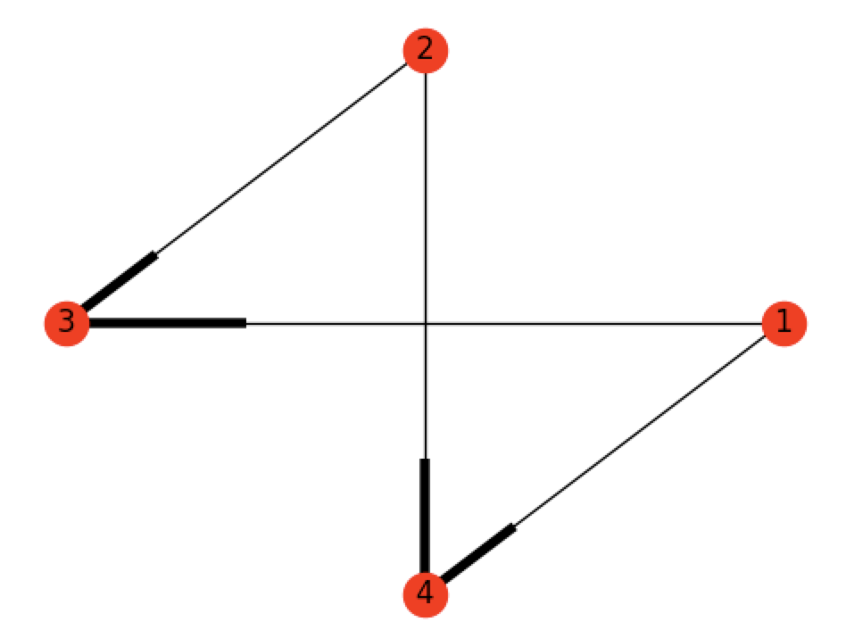
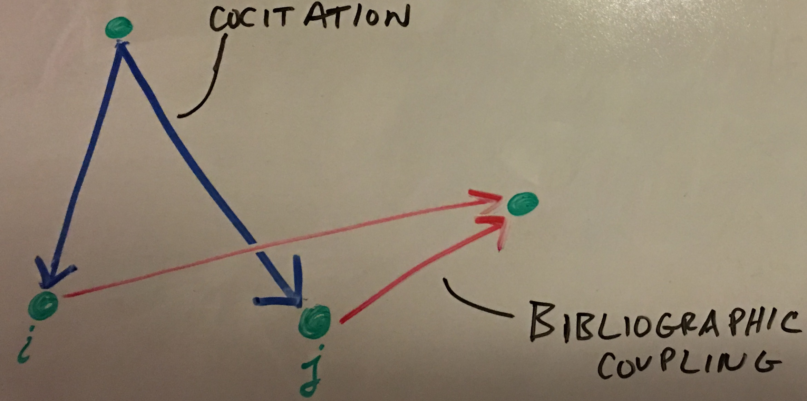
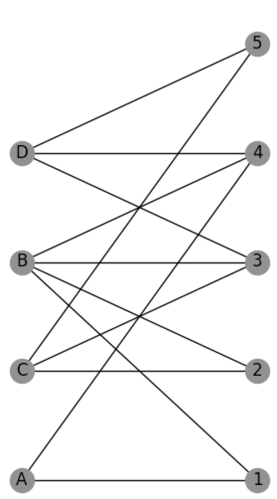

Graphs may be represented in the form of a matrix. Main types of graphs that may be represented are:

* Simple Graph
* Multigraph
* Directed Graph
* Weighted Graph
* Bipartite Graph

### Directed Graph
Directed graphs are graphs that contain edges with direction. Vertices may have inward and outward edges.

Unlike adjacency matricies for simped graphs, adjacency matricies for directed graphs are non-symmetric. Elements of an adjacency matrix for a directed graph may be denoted as:
$$A_{ij}$$
which represents an edge from vertex $j$ to $i$. 

The corresponding adjacency matrix for the graph above is:
$$A = \begin{pmatrix}0 & 0 & 0 & 0\\\ 0 & 0 & 0 & 0\\\ 1 & 1 & 0 & 0\\\ 1 & 1 & 0 & 0 \end{pmatrix}$$

### Cocitation
The cocitation of two vertices $i$ and $j$ in a directed network is the number of vertices that have outgoing edges pointing to both $i$ and $j$. We can see that:

$$A_{ik}A_{jk} = 1$$

if $i$ and $j$ are both cited by $k$. If we sum over all these elements we get the following relation:

$$C_{ij} = \sum\limits_{k=1}^n A_{ik}A_{jk} = \sum\limits_{k=1}^n A_{ik}A_{kj}^T = AA^T $$

This is a cocitation network for which there is an edge between $i$ and $j$ if $C_{ij} > 0$, for $i \neq j$.

The diagonal elements of the cocitation matrix are given by:

$$C_{ii} = \sum\limits_{k=1}^n A_{ik}^2 = \sum\limits_{k=1}^n A_{ik}$$

In constructing the cocitation network we ignore these diagonal elements, meaning that the network's adjacency matrix is equal to the cocitation matrix but with all the diagonal elements set to zero.

### Bibliographic Coupling

Cocitation and Bibliographic coupling are similar mathematically but give different results. They're both affected by the number of in and out edges. Bibliographic Coupling of two vertices are the number of other vertices to which both $i$ and $j$ point to. Bibliographic Coupling is general more stable since the number of citations can vary with time. Bibliographic Coupling is known at time of publishing and doesn't change at all. This may or may not be a good thing depending on the situation. Mathematically, it can be described by the following:

$$B_{ij} = \sum\limits_{k=1}^n A_{ki}A_{kj} = \sum\limits_{k=1}^n A_{ik}^TA_{kj} = A^TA $$

The diagonal elements of $\textbf{B}$ are:

$$B_{ii} = \sum\limits_{k=1}^n A_{ki}^2 = \sum\limits_{k=1}^n A_{ki}$$

$B_{ii}$ is equal to the number of other vertices that vertex $i$ points to - the number of papers $i$ cites.

### Hypergraphs

Networks with link that join more than two vertices are called hypergraphs. These types of graphs are useful when representing family relations for example. Edges that relate more than two vertices are called hyperedges. In sociology, these networks may be called *affiliation networks*.

### Bipartite Networks

Hypergraphs may be difficult to deal with and represent mathematically but a tool that can help are bipartite graphs - a way of conveniently representing the hypergraph structure. In sociology, this may be called: *two-mode networks*. Edges only exist between two vertices of unlike-types.

The adjacency matrix for a bipartite graph is a rectangular matrix called an *incidence matrix* which is a $g$ by $n$ matrix where $g$ is the number of groups and $n$ are the number of members in the groups.

$$B_{ij} = \begin{cases} 
      1, & \textit{if vertex j belongs to group i} \\
      0, & \textit{otherwise}
\end{cases}$$

The adjancency matrix for the bipartite graph above can be written as a $4$ by $5$ matrix:

$$B = \begin{pmatrix}1 & 0 & 0 & 1 & 0\\\1 & 1 & 1 & 1 & 0\\\0 & 1 & 1 & 0 & 1\\\0 & 0 & 1 & 1 & 1\end{pmatrix}$$

This is a much easier way of representing the hypergraph of actors to movies for example. For much info, read section 6.6 (p.125) of Networks - An Introduction (Newman).

The bipartite graph can be broken down even further by making two one-mode projections. One projection can be made with the *groups* side and another can be made with *members* side. These projections have the benefit of being simpler to study but are less powerful because information is lost through these projections.

The two one-mode projections in words are:

* The number of groups for which members $i$ and $j$ are both a part of. This is an $n$ x $n$ matrix: $$P = B^TB$$
* The number of common members of groups $i$ and $j$. This is a $g$ x $g$ matrix: $$P'=BB^T$$

#### Quick Thought
Naturally you want to relate this to cociation and bibliographic coupling networks but it may be confusing to do so. The main difference between cocitation and bibliographic coupling is the direction of the arrows. This bipartite network consists of two different types of nodes and un-directed edges. Therefore, you may have some cyclic thinking if you try to relate them too much. Although The *first* projection (the one on the members) is similar to the cocitation network in that the diagonals should be ignored and forced to be zero.

#### Information Loss

Although these projections make life a little easier, it does come at a cost: loss of information. Some of the things we loose are the number of groups in the network and the exact membership of each group. If we make the projection weighted graphs, we can at least get information as to how many commons groups a pair of vertices share for example.

### Trees
A *tree* is a connected, undirected network that contains no closed loops. Connected means that every vertex in the network is reachable from every other via some path through the network. A network can also consists of two or more parts. If the individual parts of the network are trees, the then network as a whole is considered a forest. There are leaves on a tree - vertices with one edge on them but topologically, there isn't really a root.

The most important property of a tree is that, since there are no closed loops, there is only one path between any pair of vertices. In a forest, there is at most one path but there may be none.

Another very useful property of trees is that a tree of $n$ vertices always has $n-1$ edges. The reverse is also true: any connected network with $n$ vertices and $n-1$ edges is a tree. If such a network were not a tree then there must be a loop in the network somewhere, implying that we could remove an edge without disconnecting any part of the network.

### Planar Network

Simply put, a planar network is a network that can be drawn on a plane without having any edges cross. All trees are planar but most of the time, network are not planar (e.g., citation networks, metabolic networks, internet, etc.). Some networks are forced to be planar because of physics space constraints such as rivers or road networks.

These types of networks play an important role in the *four-color theorem* which state that the number of colors required to color a graph in this way is called the chromatic number of the graph and many mathematical results are known about chromatic numbers.

An important to point out is that there is a method of determining if a network is planar. It's fairly easy to tell by observation if the network is small but when the network is very large, a general method is required.

*Kuratowski's Theorem*: Every non-planar network contains a least one subgraph that is an expansion of $K_5$ and $UG$. (Read more about this on p. 132 of Networks - an Introduction (Newman)).

### Degree

#### Mean Degree
We will denote the degree of vertex $i$ by $k_i$. For an undirected graph of n vertices the degree can be written in terms of the adjacency matrix as:

$$k_i = \sum\limits_{j=1}^n A_{ij}$$

Every edge in an undirected graph has two ends and if there are m edges in total then there are $2m$ ends of edges. But the number of ends of edges is also equal to the sum of the degrees of all the vertices, so

$$2m = \sum\limits_{i=1}^n k_i$$

Another way of writing this that is more intuitive is:

$$m = \frac{1}{2}\sum\limits_{i=1}^n k_i = \frac{1}{2}\sum\limits_{ij}^n A_{ij}$$

The mean degree $c$ of an undirected graph is:

$$c = \frac{1}{n} \sum\limits_{i=1}^n k_i$$

And combining this with the earlier equation:

$$c = \frac{2m}{n}$$

#### Density

The maximum possible number of edges in a simple graph is $\binom{n}{2} = \frac{1}{2}n(n-1)$. The connectance or density $\rho$ of a graph is the fraction of these edges that are actually present:

$$\rho = \frac{m}{\binom{n}{2}}=\frac{2m}{n(n-1)}=\frac{c}{n-1}$$

When the network is sufficiently large, $\rho$ may be approximated with just $\frac{c}{n}$.

A network where $\rho$ tends to a constant as $n \rightarrow \infty$ is said to be *dense*. A network in which $\rho \rightarrow 0$ as $n \rightarrow \infty$ is said to be *sparse*.

#### Directed Network Degree

Vertex degrees in a directed network are more complicated. They are broken up into *in-degree* and *out-degree*. If $A_{ij}$ is the adjacency matrix of a directed network, the *in* and *out* degree can be written as:

$$k_i^{in} = \sum\limits_{j=1}^n A_{ij},\ \ \  k_j^{out} = \sum\limits_{i=1}^n A_{ij}$$

We also know the number of edges are:

$$m = \sum	\limits_{i=1}^n k_i^{in} = \sum\limits_{j=1}^n k_j^{out} = \sum	\limits_{ij} A_{ij}$$

As far as the mean degree of directed networks:

$$c_{in} = \frac{1}{n} \sum\limits_{i=1}^n k_i^{in} = \frac{1}{n} \sum\limits_{j=1}^n k_j^{out} = c_{out}$$

Combining these two relations, the mean degree can concisely be written as:

$$c = \frac{m}{n}$$

### Paths

A path along a network is a route across the network moving from vertex to vertex along the edges. In a directed network, the path can on go in the direction of the edge but can go either way for an undirected network. A path may reach a vertex or go along an edge it has seen before. A path that does not intersect itself is considered a *self-avoiding path*. Geodesic paths and Hamiltonian paths are two special cases of self-avoiding paths.

The number of paths of length $r$ may be important to study and can be calculated for directed and undirected networks. We will use the fact that for directed and undirected networks, $A\_{ij}$ is 1 if there is an edge from vertex $j$ to vertex $i$, and 0 otherwise. We can start by asking how many paths of length 2 are there in a network. Imagine we want to study all paths of length 2 from $j$ to $i$ via $k$. The product $A\_{ik}A\_{kj}$ is 1 where there is a path of length 2 from $j$ to $i$ via $k$, and 0 otherwise.

$$N_{ij}^{(2)} = \sum\limits_{k=1}^n A_{ik}A_{kj}=\left[A^2\right]_{ij}$$

We can study the path of length 3 as well. The product $A\_{ik}A\_{kl}A\_{lj}$ is 1 where there exists a path of length 3, and 0 otherwise.

$$N_{ij}^{(3)} = \sum\limits_{k,l=1}^n A_{ik}A_{kl}A_{lj}=\left[A^3\right]_{ij}$$

Generalizing to any length $r$ gives:

$$N_{ij}^{r}=\left[A^r\right]_{ij}$$

There is a proof of induction on page 137 of Network - An Introduction (Newman).

Another important thing to consider are loops in a network. The number of loops may be calculated as well.

$$L_r = \sum\limits_{i=1}^n\left[A^r\right]_{ii}=Tr A^r$$

There 'Tr' is the trace of a matrix. The number of loops can be written in terms of the eigenvalues of the adjacency matrix as well. The adjacency matrix can be written as $A=UKU^T$ where $U$ is the orthogonal matrix of eigenvectors and $K$ is the orthogonal matrix of eigenvalues:

$$A^r = (UKU^T)^r = UK^rU^T$$

$$L_r = Tr(UK^rU^T)=Tr(U^TUK^r)=Tr(k^r)=\sum\limits_i k_i^r$$

Where $k_i$ is the $i^{th}$ eigenvalue of the adjacency matrix. This applies to directed and undirected graphs. There is one important thing to note when learning about counting the number of loops on length r. For each consideration below, the calculation for determining the number of loops uses the following criteria for counting distinct loops.

* Although there are loop paths that have the same vertices and same order, if there are different starting points, then they are considered separate loops.

$$1\rightarrow 2\rightarrow 3 \rightarrow 1 \ \ \ and \ \ \ 2\rightarrow 3\rightarrow 2 \rightarrow 1$$

* If loops are in the opposite direction, they are counted as distinct loops.
$$1 \rightarrow 2 \rightarrow 3 \rightarrow 1 \ \ \ and \ \ \ 1 \rightarrow 3 \rightarrow 2 \rightarrow 1$$

### Geodesic Paths
A geodesic path is shortest network distance between vertices in question. This is also called *geodesic distance* or *shortest distance*. Mathematically, a geodesic distance is the smallest value of r such that $\left[ A^r \right]_{ij} > 0$ between vertices $i$ and $j$.

It may be the case that no shortest distance exists (for example: for separate components of the network where the distance may be said to be infinity). Another interesting fact - If a path intesects itself, it has a loop and therefore cannot be a geodesic path since it can be shortened by removing this loop.

The *diameter* of a graph is the length of the longest geodesic path between any pair of vertices in the network for which a path actually exists.

### Eulerian and Hamiltonian Paths

* **Eulerian Path**: a path that traverses each edge in the network exactly once
* **Hamiltonian Path**: a path that visits each vertex exactly once

If there are any vertex degree greater than 2, then the Eulerian path is not self-avoiding since it has to visit vertices more than once in order to traverse tall their edges.

#### Kronigsberg Bridges
This problem becomes finding an Eulerian path on this network of bridges and the name is in honor of Euler who presented this problem. Euler observed that since any Eulerian path must both enter and leave every vertex it passes (except for the first and last), there can at most be two vertices with odd degree. All four of the vertices in the Kronigsberg Problem has odd degree. More precisely, there can only be 2 or 0 vertices of odd degree for an Eulerian condition to be possible. With this logic, Euler proved the Kronigsberg problem has no solution.