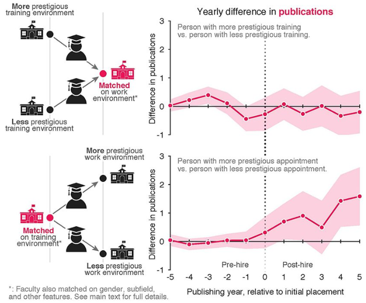

# Keeping Up With Complex Systems Science News

It can be difficult to find time to keep up with interesting science, especially when articles are dense and abstruse. With an unfortunate name like complex systems, keeping up with the intersting news can be a daunting task. Here are a few resources that I use to keep up with the fascinating world of complex systems and systems engineering.

# 
[Santa Fe Institute](https://www.santafe.edu/news-center/news)

# 
[Sante Fe Institute Complexity Explorer](https://www.complexityexplorer.org/explore/browse)

# 
[Quanta Magazine](quantamagazine.org)

 
 

# 
[Nature](https://www.nature.com/subjects/complexity)

The Nature journal has a **Complexity** page that shows the latest new for complex systems.

