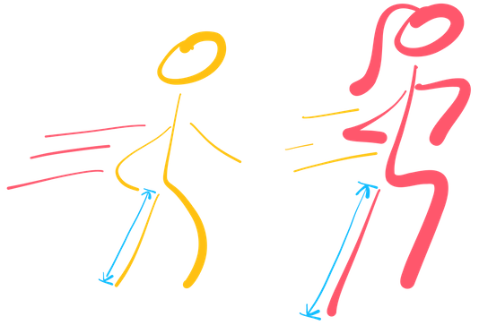

# Chicagoans Always Speed

My morning commute to work in the heart of downtown Chicago is very regular: Enjoy blazing hot coffee and listen to an interesting podcast all while super-speed-walking all the way to the office. I often think how much time I would save by teleporting to the office instead. Even while often walking faster than most on the busy morning sidewalks, there are folks that zoom past me but still appear to be walking gracefully.

To start, let’s break speed walking down to two main factors: long legs and step frequency (which differs from walking speed). I like to think I take advantage of both of these to maintain optimal walking speed (without looking too ridiculous). The general question to myself was this:

### For someone whose legs are longer than mine, how much faster do I have to walk to keep up?

Another way to ask this is, how are the leg length and step-frequency related? If two people, Person A and Person B, are walking at the same step frequency but Person B has longer legs than Person A by a factor of alpha (alpha > 1), Person B will clearly have a faster walking speed. Therefore, you can ask by what factor does Person A’s step frequency has to increase to keep up with Person B's speed while walking down the street.

Let’s go through it logically together. Let's draw the some simple person possible:

Given how we're thinking about this problem, the important values we should be interested in is **Leg Length** and **Step Frequency**. The angle created by the legs may be important to so let's lable it for now.

# First Step (Literally)

### What happens when one step is taken by **Person A** and **Person B**

The distance that each person goes in one step is given by:

$$d_A = 2A \sin\left(\frac{\theta_A}{2}\right)$$
$$d_B = 2B \sin\left(\frac{\theta_B}{2}\right)$$

Where $A$ and $B$ are the length of the legs of **Person A** and **Person B**, respectively.

Let's simplify some things before we generalize the problem:

$$\tilde{A} = 2A$$
$$\tilde{B} = 2B$$
$$\gamma = \sin\left(\frac{\theta_A}{2}\right) = \sin\left(\frac{\theta_B}{2}\right)$$
$$d_A = \tilde{A} \gamma$$
$$d_B = \tilde{B} \gamma$$

# More Steps

As shown above, we've made the assumption that $\theta_A = \theta_B$. Let's generalize this to more than one step. Here we will introduce a person's **Step Frequency**, $s_A$ and $s_B$, defined as how many steps a person takes per unit time, $t$.

$$d_A(t) = \tilde{A} \cdot \gamma \cdot  s_A \cdot  t$$
$$d_B(t) = \tilde{B} \cdot \gamma \cdot s_B \cdot t$$

The general form can be thought of as the linear relationship:

$$d = \kappa \cdot s \cdot t$$

where $\kappa_A = \tilde{A} \gamma$ or $\kappa_B = \tilde{B} \gamma$.

# Keep Up!

Here is the main problem for us to go through in order to answer the original question. Let's make **Person B** have longer legs than **Person A** by a factor of $x$.

$$B = x A$$

Generally, since **Person B** has longer legs, the Step Frequency of **Person A**, $s_A$, has to increase to keep up.

Now let's look at the ratio $\frac{d_B}{d_A}$:

$$\frac{d_B}{d_A} = \frac{2 x A \gamma s_B t}{2 A \gamma s_A t} = \frac{x s_B}{s_A}$$

To make distance the same between the two people, we'll make: $\frac{d_B}{d_A} = 1$

$$\frac{d_B}{d_A} = 1 = \frac{x s_B}{s_A}$$
$$s_A = x s_B$$

# WHAT THE HECK DID WE LEARN?

If a **Person B** has legs longer than **Person A** by a factor of $x$ and $\theta_A$ = $\theta_B$, then **Person A** can keep up by increasing their step frequency by this same factor, $x$. Basically **Person A** can move their legs faster by this factor to keep up with **Person B**.

Suppose we have the following values as an example:

$$A=1.5m \ \ \ \text{(leg length of A)}$$
$$B=2m \ \ \ \text{(leg length of B)}$$
$$\theta_A = \theta_B = 20^\circ \ \ \ \text{(leg separation angle)}$$
$$s_A = s_B = 1 hz \ \ \ \text{(step frequency)}$$

Since Person B has $2/1.5=1.33333$ times the leg length of Person A, we can increase the step frequency of A to keep up with Person B's speed. The factor we'll use to do this is the same $1.3333...$ factor. Let's confirm with a visualization of their step patterns.

$$s_A = 1.33333... hz \ \ \ \text{(step frequency of A)}$$
$$s_B = 1 hz \ \ \ \text{(step frequency of B)}$$

### This is very simplified. What happens if $\theta_A \neq \theta_B$? Are there other factors to consider?

# 
THAT'S ALL, GOTTA RUN

