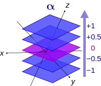
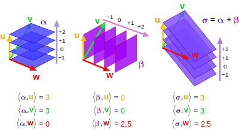

Motivation:

* General Relativity
* Inertia Tensor
* Stress Tensor

It took me a whole week figure out what a tensor actually is. You will find many definitions and some are only partially correct. Let's walk through the different explanations and learn how to think about them.

1. **(Array Definition)** Tensor = Multi-dimensional array of numbers (scalars (rank 0), vectors (rank 1), matricies (rank 2), etc.). This is true in a sense but there is a truer geometrical meaning behind the concept of a tensor.
2. **(Coordinate Definition)** Tensor = an object that is invariant under a change of coordinates and has *components* that change in a special, predictable way under a change of coordinates. This is also true but let's dive even deeper to learn how a tensor allows this behavior to take place.
3. **(Abstract Definition)** Tensor = a collection of vectors and covectors combined together using the tensor product

The important thing to keep in mind is that vectors exist independently of their components and their components depend on the coordinate system used to define vectors.

# Changing Coordinate Systems

Let's go from an old basis to a new basis

Old Basis: {$\vec{e_1}, \vec{e_2}$}

New Basis: {$\tilde{\vec{e_1}}, \tilde{\vec{e_2}}$}

### Forward Transformation
Suppose:
$$\tilde{\vec{e_1}} = 2\vec{e_1}+1\vec{e_2}$$
$$\tilde{\vec{e_2}} = -\frac{1}{2}\vec{e_1}+\frac{1}{4}\vec{e_2}$$
$$F = \begin{pmatrix}2 & 1\\\ -\frac{1}{2} & \frac{1}{4}\end{pmatrix}$$
where $F$ is the Forward Transformation Matrix.

### Backward Transformation
This would make the backward transformation:
$$\vec{e_1} = \frac{1}{4}\tilde{\vec{e_1}}+(-1)\tilde{\vec{e_2}}$$
$$\vec{e_2} = \frac{1}{2}\tilde{\vec{e_1}}+2\tilde{\vec{e_2}}$$
$$B = \begin{pmatrix}\frac{1}{4} & -1\\\ \frac{1}{2} & 2\end{pmatrix}$$

### Forward and Backward Transformation
$$F \cdot B = \begin{pmatrix}2 & 1\\\ -\frac{1}{2} & \frac{1}{4}\end{pmatrix} \begin{pmatrix}\frac{1}{4} & -1\\\ \frac{1}{2} & 2\end{pmatrix} = \begin{pmatrix}1 & 0\\\ 0 & 1\end{pmatrix}$$

In general:
$$F \cdot B = \delta_{ij}$$
$$F = B^{-1}; B = F^{-1}$$
$$\tilde{\vec{e_i}} = \sum\_{j=1}^{n} F\_{ij} \vec{e_j}$$
$$\vec{e_i} = \sum\_{j=1}^{n} B\_{ij} \tilde{\vec{e_j}}$$

# Vectors
Vectors are the first example of a tensor. Vectors are invariant but their components are *NOT* invariant. It is also important to know that not all vectors are geometrical Euclidean vectors. Some vectors that are harder to visualize.

The transformation rules for vectors behave in an opposite way compared to the basis vectors {$\vec{e_1}, \vec{e_2}$}

$$\vec{v} = \sum\_{j=1}^{n}v_j \vec{e_j} = \sum\_{i=1}^{n} \tilde{v_i} \tilde{\vec{e_i}}$$

$$\vec{v} = \sum\_{j=1}^{n} v_j \vec{e_j} = \sum\_{j=1}^{n} v_j \left( \sum\_{j=1}^{n} B\_{ij} \tilde{\vec{e_j}} \right) = \sum\_{i=1}^{n} \left( \sum\_{j=1}^{n} B\_{ij} v_j \right) \tilde{\vec{e_i}}$$

So this shows that:
$$\tilde{v_i} = \sum\_{j=1}^{n} B\_{ij} v_j$$
Which basically means that if you want to define the vector is the new basis, we have to use the backwards transformation matrix. This will take some getting used to since it is opposite of the unit basis. For this reason, vectors are said to contravary and are even called **contravariant vectors**.

|Basis|Vectors|
|:---------------------:|:---------------------:|
| $$\tilde{\vec{e_i}} = \sum\_{j=1}^{n} F\_{ij} \vec{e_j}$$ | $$\tilde{v_i} = \sum\_{j=1}^{n} B\_{ij} v_j$$
| $$\vec{e_i} = \sum\_{j=1}^{n} B\_{ij} \tilde{\vec{e_j}}$$ | $$v_i = \sum\_{j=1}^{n} F\_{ij} \tilde{v_j}$$ |

# Notation
In tensor calculus, notation can be tricky so it will be helpful to keep a couple tips about notation in mind:

* Upper indicies represent contravariant components
* Lower indicies represent covariant components
* Einstein notation uses the upper and lower indicies and also drops the $\sum$ symbol
* When a covector $\alpha_j$ is acting on a vector $v^j$, it can be written as $\alpha_j v^j$ and is assumed to be the sum:
$$\alpha_j v^j = \sum\_{j=1}^n \alpha_j v^j = \alpha_1 v^1 + \alpha_2 v^2 + \alpha_3 v^3 + ... + \alpha_n v^n$$
* Using this new notation convention, the formulas in the table above can be written as:

|Basis|Vectors|
|:---------------------:|:---------------------:|
| $$\tilde{\vec{e_i}} = F_i^j \vec{e_j}$$ | $$\tilde{v^i} = B_j^i v^j$$
| $$\vec{e_i} = B_i^j \tilde{\vec{e_j}}$$ | $$v^i = F_j^i \tilde{v^j}$$ |

# Covectors

Covectors may be harder to visualize since it differs from the arrow Euclidean vectors that is often used in physics. Here are a couple initial notes about covectors:

* Covectors can be thought of as row vectors but clarification is needed for this. Row vectors in this sense are not necessarily column vectors flipped on their side. This is only true when using an orthonormal basis. If the basis is not orthonormal, it is more apparent how row vectors are different from column vectors.
* It is better to think of covectors as functions that act on vectors and map them to real numbers:

$$\alpha: V \rightarrow \mathbb{R}$$

* When we visualize vectors, we think of them as Euclidean vectors with components in a system of coordinates. A covector can be visualized as directed stacks of lines (or surfaces). Below are a few images that can help visualize covectors:

The inner product is a mechanism used to combine a covector and vector. The output is a number that represents the number of surfaces of the covector that are pierced by the vector.

### Covector Rules To Keep In Mind:

Covector acting on a vector:
$$\alpha(\vec{v}) = \alpha_1 v^1 + \alpha_2 v^2 + \alpha_3 v^3 + ... + \alpha_n v^n = \sum\_{j=1}^n \alpha_j v^j$$

Properties of Linearity:
$$\alpha(\vec{v} + \vec{w}) = \alpha(\vec{v}) + \alpha(\vec{w})$$

$$\alpha(n \vec{v}) = n \alpha(\vec{v})$$

$$(\beta + \gamma)(\vec{v}) = \beta(\vec{v}) + \gamma(\vec{v})$$

Vector Spaces:

* When scaling and combining vectors, a vector space $V$ is spanned
* Covectors can also be scaled with scalars and combined using addition and multiplication. The vector space spanned by covectors is called the "Dual Vector Space", $V^*$.

# Linear Maps
