#### Simulation and Analysis of War (the card game)
> Game designer Greg Costikyan has observed that since there are no choices in the game, and all outcomes are random, it cannot be considered a game by some definitions. I chose to program this game because its complete random chance feature. It was an opportunity to practice python and writing recursive functions.
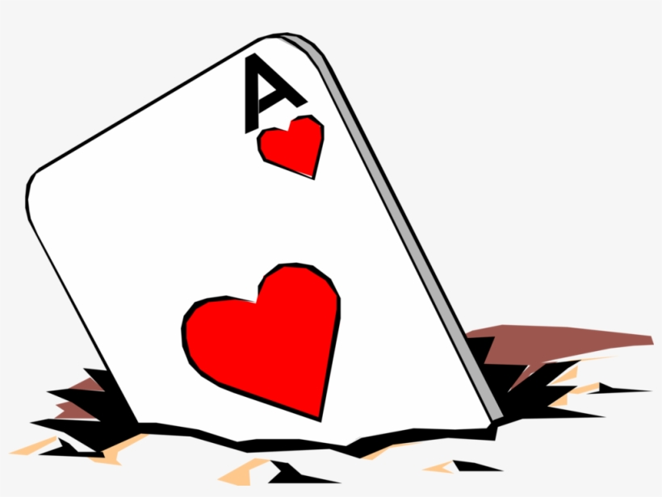

# The objective of the game is to win all cards.


A 52-card deck is divided evenly among the players, giving each a down stack. In unison, each player reveals the top card of their deck—this is a "battle"-and the player with the higher card takes both of the cards played and moves them to their reserves stack. The reserves stack is used when there are no longer cards to play in hand.

If the two cards played are of equal value, then there is a "war". Both players place the next three cards from their hand face down (depending on the variant) and then another card face-up. The owner of the higher face-up card wins the war and adds all six cards on the table to their reserves deck. If the face-up cards are again equal then the battle repeats with another set of face-down/up cards. This repeats until one player's face-up card is higher than their opponent's. This is the part of the game where recursion is helpful. In theory, there can be any number of "wars" only constrained by the number of cards in the deck. Most descriptions of War are unclear about what happens if a player runs out of cards during a war. In this variant, the player immediately loses.

Below are several simulations that were run to explore game behavior

# Simple Game

This is a shorter game than average with **3** wars which can be identified by the lines with steeper slopes.
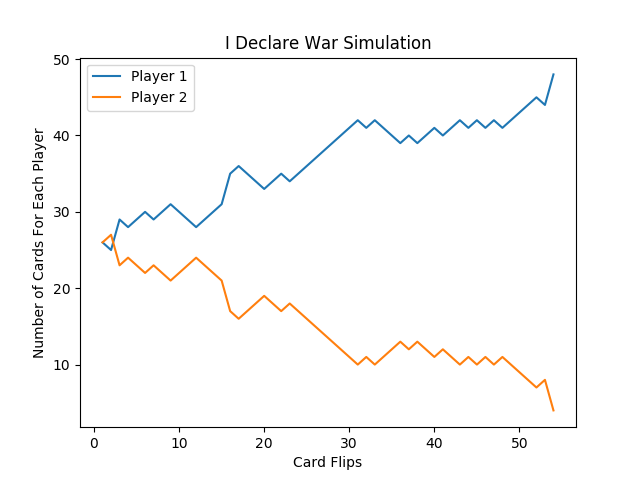

This is a slightly longer game with only **4** wars which occur on card flip: 48, 90, 117, and 152.
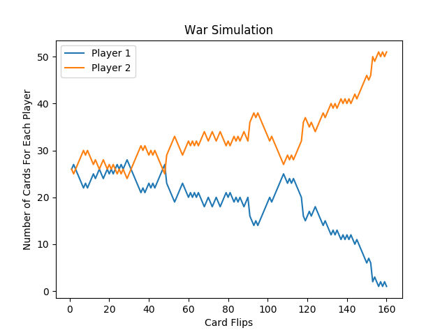

# Blowing Up

There is "blowing up" behavior for some games as well. This behavior is typically exacerbated by wars won by the same player.

|||
|:---------------------:|:---------------------:|
| 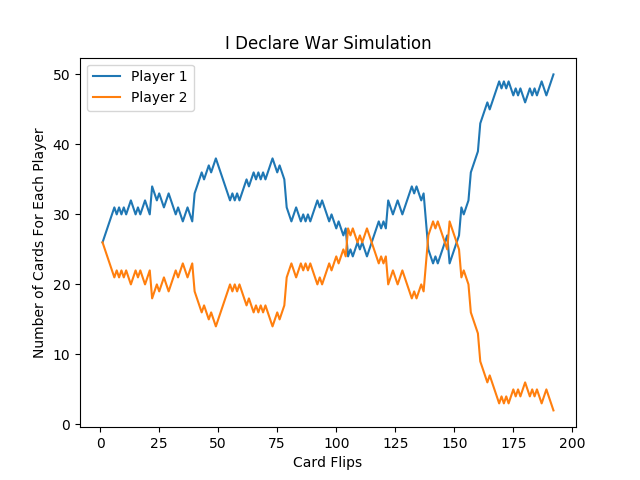 | 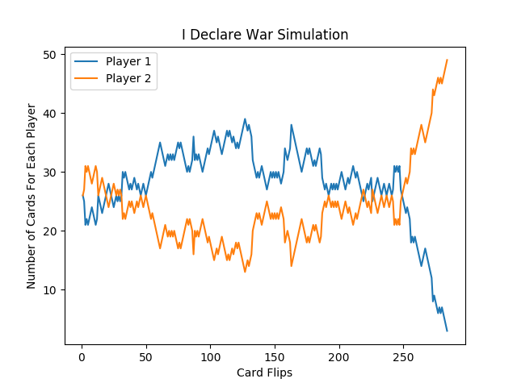 |
| 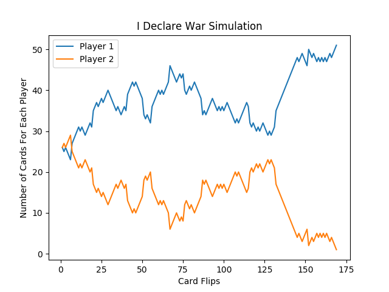 | 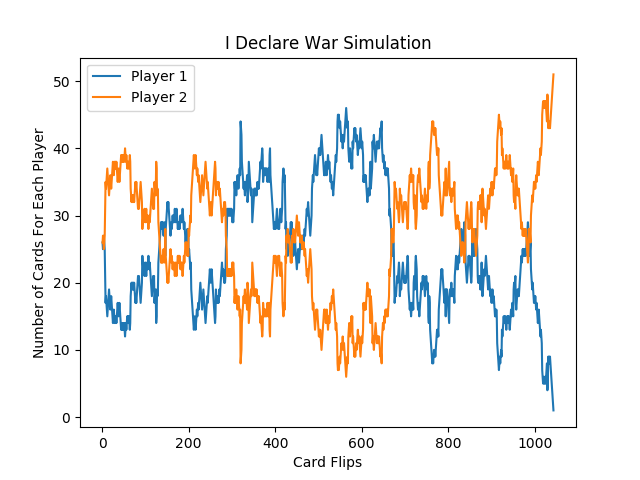 |

### Triple War
When wars occur consecutively, a mass number of cards are moved at once. The example below shows a triple war happening which led Player 2 winning the game. The war began at card flip 698.


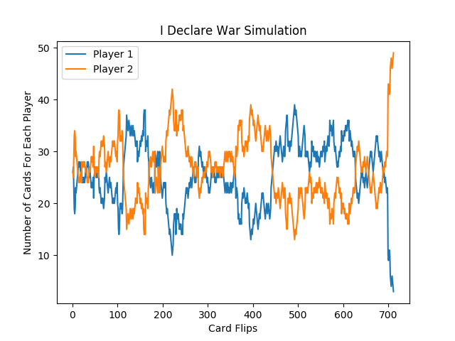

# Number of Wars Per Game

### What is the War and Game Length relationship?

One question that we can ask is how does the number was wars in a game relate to the length of the game itself. I modified the program so that it simulated 1000 games and plotted the number of wars versus the length of each game. Below is the result of this simulation.


As you can see, there is a strong linear relationship between the these two quantities. The $R^2 \approx 1$ value is a helpful indicator of this. The $R^2$ and linear equation are:

$$R^2 = 0.9225$$
$$y(x)=0.0549x+1.2212$$

### How many battles are played before a war breaks out?

This slope tells us that there is a war every approximately 19 "battles" (where a battle is a single card flip). To prove this by dividing the game length data by 19 and replotting. This would make every x-axis unit equal to 19 battles. If our claim is true, there should be a one-to-one relationship between our new unit and the number of wars per game. Let's plot it:

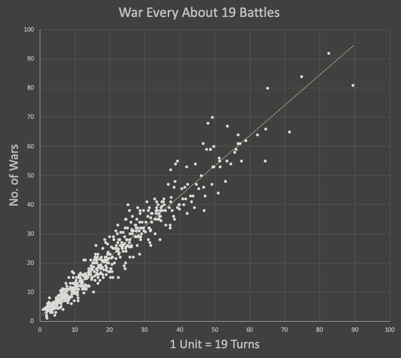

The trendline has an equation whose slope is close to 1. This is a good sign that our value of 19 is a nice estimate.

$$y(x) = 1.0391x+1.4576$$

### Distribution of Quantities

It may be helpful to know how the game length or war count themselves are distributed. Below are two histgrams that can give insight into their spread. From the two plots below, we can see that these two distribution are somewhat normal with a slight right skew.


# Change The Size Of The War!

When two cards are equal a war begins. In this variant of the game, three additional cards are played face-down and a fourth card is used to do another comparison. This is essentially what a "war" is in this game. We can change the size of the wars - which means we can change the number of face-down cards we throw down before we do another comparison. Here is a table:

<center>

|War Size|Meaning|
|:---------------------:|:---------------------:|
| War Size = 2 | 2 face-down cards before comparing the 3th card during war
| War Size = 3 | 3 face-down cards before comparing the 4th card during war
| War Size = 4 | 2 face-down cards before comparing the 5th card during war |
</center>

It would be helpful to plot the WC versus GL plot for each war size. From the plot we can observe how the slope of the linear regression equation changes (or how the "war per battle" value changes with war size). Click on plot below to see it in detail:

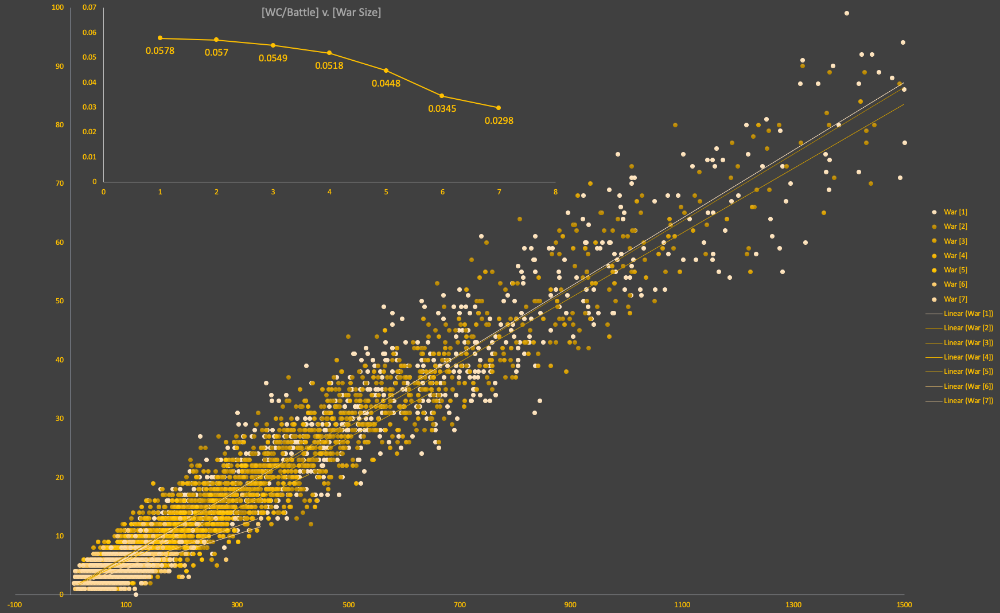

### How does Average Game Length and War Count change with War Size

The plot below is a clear picture into how the averages and medians change when we change war size

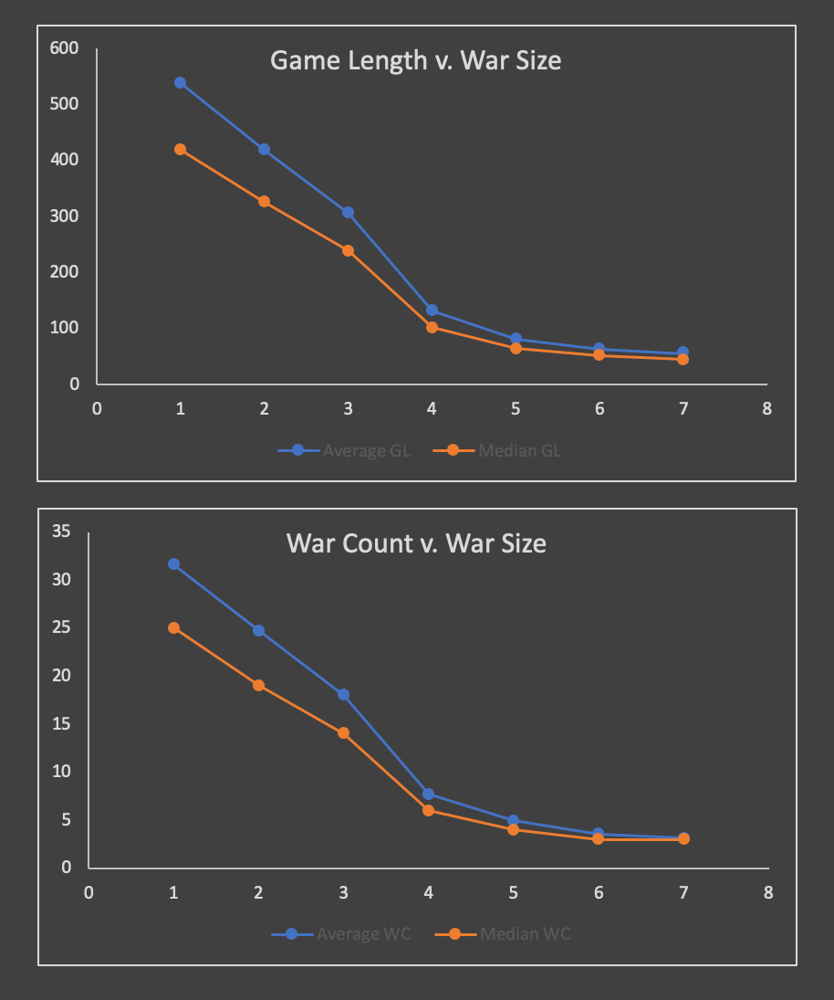

It appears that the larger the war size, the more normal the distribution becomes since the average and median approach the same value.

Another way of looking at the game length for different values of war size would be with a layered bar graph. When the data is ordered and plotted with each war size being a layer, we can create the following graph.

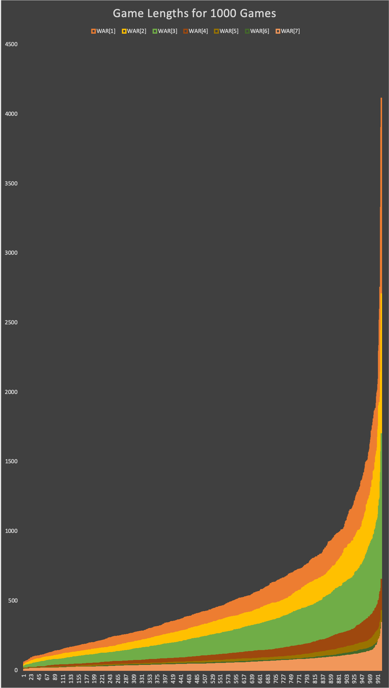

This graph also shows that the larger the War Size, the smaller the Game Length. Is there anything else we can look into for the analysis of this game?

# The Code

The program has been written in Python and is copied below for those interested.

``` python
# Title: War Simulation
# Date: 3/16/2019
# Author: Eric Pena

from random import shuffle
import random
import pandas as pd
import matplotlib.pyplot as plt
# Create Deck and shuffle it
deck = []
deck = range(13) * 4
shuffle(deck)
# Deal the cards
player1 = deck[::2]
player2 = deck[1::2]
# Create Reserve Piles
player1_res = []
player2_res = []
# Define more variables
topcard = 0
# Game counter
turn = 1
# Calculate the total cards a player has: hand + reserves
#----------------------------------------------------------------------------------------------------------------------------------------------
def total_cards(h, r):
	return (len(h) + len(r))
# Recursive function that happens when war starts	
#----------------------------------------------------------------------------------------------------------------------------------------------
def idw(player1, player2, player1_res, player2_res, jackpot):
	# DEBUG
	print "WAR BREAKS OUT..."
	# Add reserve to hand and shuffle if hand is less than 4 cards:
	if (len(player1) < 4):
		player1.extend(player1_res)
		player1_res = []
		shuffle(player1)
	if (len(player2) < 4):
		player2.extend(player2_res)
		player2_res = []
		shuffle(player2)
	# If this is still not enough cards, clear the cards and stop the game
	if (len(player1) < 4 or len(player2) < 4):
		player1, player2, player1_res, player2_res = ([] for i in range(4))
		return player1, player2, player1_res, player2_res
	# Remove top three cards and put them in reserve pile
	jackpot.extend([player1[0], player1[1], player1[2], player2[0], player2[1], player2[2]])
	player1 = player1[3:]
	player2 = player2[3:]

	# Use fourth card to compare
	if player1[topcard] > player2[topcard]:
		print "PLAYER 1 WINS WAR: " + str(player1[topcard]) + " - " + str(player2[topcard])
		player1_res.extend([player1[topcard], player2[topcard]])
		player1_res.extend(jackpot)
		# Remove cards from hand
		player1 = player1[1:]
		player2 = player2[1:]
		return player1, player2, player1_res, player2_res
	
	elif player1[topcard] < player2[topcard]:
		print "PLAYER 2 WINS WAR: " + str(player1[topcard]) + " - " + str(player2[topcard])
		player2_res.extend([player1[topcard], player2[topcard]])
		player2_res.extend(jackpot)
		# Remove cards from hand
		player1 = player1[1:]
		player2 = player2[1:]
		return player1, player2, player1_res, player2_res
	
	else:		
		print "ANOTHER WAR BEGINS: " + str(player1[topcard]) + " - " + str(player2[topcard])
		jackpot.extend([player1[0], player2[0]])
		player1 = player1[1:]
		player2 = player2[1:]
		return idw(player1, player2, player1_res, player2_res, jackpot)

# Start the game
#----------------------------------------------------------------------------------------------------------------------------------------------
def play_game(player1, player2, player1_res, player2_res, turn):
	# Create a record of the game
	cols = ["Round", "P1 card", "P2 card", "P1 t-len", "P2 t-len", "P1 h-len", "P2 h-len"]
	datarec = pd.DataFrame(columns = cols)
	while (len(player1) != 0 and len(player2) != 0):
		print "Round: " + str(turn) + "\t|\t" + \
			str(player1[topcard]) + "\t|\t" + \
			str(player2[topcard]) + "\t|\t" + \
			str(total_cards(player1, player1_res)) + "\t|\t" + \
			str(total_cards(player2, player2_res)) + "\t|\t" + \
			str(len(player1)) + "\t|\t" + \
			str(len(player2)) + "\t|\t" + \
			str(total_cards(player1, player1_res) + total_cards(player2, player2_res))
		# Add data to pandas dataframe:
		datarec.loc[turn - 1] = [turn, player1[topcard], player2[topcard], total_cards(player1, player1_res), total_cards(player2, player2_res), len(player1), len(player2)]
		# Flip top cards and assign:
		if player1[topcard] > player2[topcard]:
			player1_res.extend([player1[topcard], player2[topcard]])
			# Remove topcard from hands
			player1 = player1[1:]
			player2 = player2[1:]
		elif player1[topcard] < player2[topcard]:
			player2_res.extend([player1[topcard], player2[topcard]])
			# Remove topcard from hands
			player1 = player1[1:]
			player2 = player2[1:]
		else:
			print "TOP: " + str(player1[topcard]) + " - " + str(player2[topcard])
			player1, player2, player1_res, player2_res = idw(player1, player2, player1_res, player2_res,[])

		# Replenish Cards
		if len(player1) == 0:
			player1 = player1_res
			shuffle(player1)
			player1_res = []
			# it1 = 0
		if len(player2) == 0:
			player2 = player2_res
			shuffle(player2)
			player2_res = []
			# it2 = 0
		turn += 1
	return player1, player2, player1_res, player2_res, datarec, turn
#----------------------------------------------------------------------------------------------------------------------------------------------
# MAIN PROGRAM:
print "Round: " + "\t\t|\t" + "P1 card" + "\t|\t" + "P2 card" + "\t|\t" + "P1-T" + "\t|\t" + "P2-T" + "\t|\t" + "P1-H" + "\t|\t" + "P2-H"

player1, player2, player1_res, player2_res, df, turn = play_game(player1, player2, player1_res, player2_res, turn)
plt.plot(df["Round"], df["P1 t-len"])
plt.plot(df["Round"], df["P2 t-len"])
plt.legend(['Player 1', 'Player 2'])
plt.title("War Simulation")
plt.xlabel("Card Flips")
plt.ylabel("Number of Cards For Each Player")
plt.show()

```
