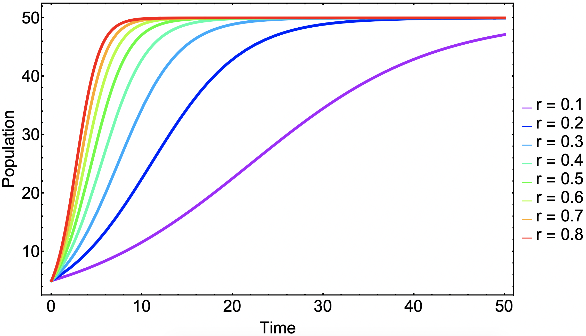

## Logistic Growth Model

The simple difference equation below will show exponential growth behavior:

$$x_t = a x_{t-1}$$

However, it is often the case that a population cannot grow indefinitely but rather reach a population limit. This limit is called the population's carrying capacity. To create a model with exponential growth but also incorporate this convergence to a population maximum limit, we may start with the following train of thought:

$$x_t = f(x_{t-1}) x_{t-1}$$

The constraints that $f(x_{t-1})$ has to satisfy is that it must pass through the points $(x, f(x)) = (0,a) $ and $(K, 1)$, where $K$ is a constant that represents the carrying capacity of the population. The simplest model would be a straight line using these two points:

$$f(x) = -\frac{a-1}{K}x+a$$

We may now use this growth ratio function to put back into our difference equation:

$$x_t = \left(-\frac{a-1}{K}x_{t-1}+a\right) x_{t-1}$$

This is generally called the *logistic growth model* written in terms of a difference equation and may be further simplified:
$$x_t = \left( - \frac{a-1}{K} x_{t-1} + a \right) x_{t-1} = x_{t-1} + r x_{t-1}\left( 1 - \frac{x_{t-1}}{K} \right)$$

where $r = a -1 $.

The logistic growth model for varying growth ratios in shown in **Figure 1**.



**Figure 1** | Logistic growth model with varying values of growth ratio $r$, carrying capacity $K = 50$, and initial condition $x_0 = 5$.

This may also be written in terms of a differential equation for the continuous version of this model:

$$\frac{d x(t)}{d t} = r x(t) \left( 1 - \frac{x(t)}{K}\right)$$

## Example

This example is problem $4.10$ from *Modeling and Analysis of Complex Systems (Sayama, H., p.55)*

* *Create a mathematical model of population growth in which the growth ratio is highest at a certain optimal population size, but it goes down as the population deviates from the optimal size. Then simulate its behavior and see how its behavior differs from that of the logistic growth model.*

A possible approach could be similar to the logic above which starts with a difference equation whose growth ratio is an arbitrary function, $f(x)$:

$$x_t = f(x) x_{t-1}$$

Since this function should be maximized at a particular population value and decrease elsewhere, a downward parabola seems to be a reasonable starting point. In basic terms, it can be written as:

$$f(x)=-a (x - p)^2 + b$$

Chosen values of $a$, $b$, and $p$ are 0.0007, 1.3, and 30, respectively. This function is displayed  in **Figure 2**.


**Figure 2** | Growth ratio function for modified logistic growth model.

The model behaves differently at various initial conditions for this modified logistic growth model. As we can this in this figure, the fate of the population is dependent on the initial conditions. This goes into a concept called stability and equilibrium points which is a very important topic as well regarding differential equations used to model dynamics systems. The solutions of this difference equation can be seen in **Figure 3**.


**Figure 3** | Logistic growth model with modified growth ratio function dependent on population.

## Plotting Solutions using Python


```python
import matplotlib.pyplot as plt
```

## Define Parameters and Iterate


```python
a = 1.3
p = 30
alpha = 0.0007
x = 10
data = [x]

for _ in range(30):
    x = (-alpha*(x - p)**2 + a)*x
    data.append(x)

plt.plot(data,'r.-')
plt.show()
```


    

    


## Mathematica Code for Solving Differential Equations


# References
* [Modeling and Analysis of Complex Systems (Sayama, H.)](http://bingweb.binghamton.edu/~sayama/textbook/)
* [Modeling Complex Systems (Boccara, N.)](https://www.springer.com/gp/book/9781441965615)
