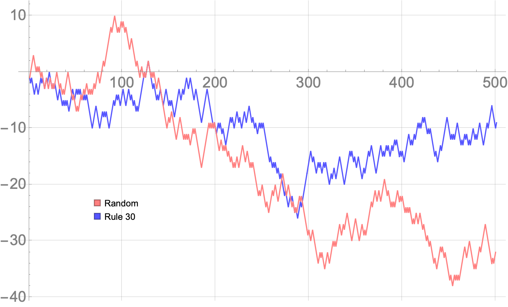
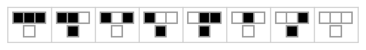

---

## Motivation

> "With four parameters I can fit an elephant, and with five I can make him wiggle his trunk." -- John von Neumann

Throughout history, science has aimed to understand and model the natural world as accurately as possible despite its inherent complexity. There are many phenomena in nature whose patterns and behavior seem somewhat unpredictable yet these resulting patterns appear highly structured and organized. Scientists and mathematicians have developed techniques (e.g., calculus, chaos theory, cellular automata) to model nature in its truest form. However, this feat can become problematic for many complex systems that surround us. They are not amenable to the traditional reductionist methodologies that were typically used in gaining scientific understanding. Generally, these systems involve complicated interactions and feedback loops between their parts making it difficult to model their behavior. Moreover, allowing these parts to also interact with their environment exacerbates this modeling dilemma. There is specific behavior which systems exhibit when they are considered complex. Common terms that have been used to describe this behavior are nonlinearity, emergence, self-organization, chaos, spontaneous order, adaptation, and many others. Phenomena such as these have been known to occur across many systems and are said to have universal properties. *Complex Systems* is a broad term that refers to the research approach that is applied to many seemingly disparate fields (e.g., physics, computer science, economics, sociology, information theory, nonlinear dynamics, meteorology, education, biology). This approach avoids being tethered to reductionist methods and instead considers that behavior can emerge and, in a sense, *be* more than the sum of their parts. At this moment, the field of complex systems is growing rapidly and not yet fully developed. A convenient entry point is building up emergence from simple models. This contributes to the unwavering popularity in cellular automata models. It involves a simple lattice structure---with a finite set of states---governed by rules that a person from any background can understand.

## Cellular Automata

Cellular automata (CA) have the ability to generate complex global patterns from simple local rules. Cellular automata are discrete dynamical systems used primarily as a computational model to study how spatiotemporal patterns evolve in a wide range of phenomena. This idea was first developed by Stanisław Ulam and John von Neumann in the 1940s. It has since been applied to an array of disparate fields: computer science, mathematics, climate science, complexity science, art, music, and many others.
    
The model is quite simple and easy for anyone to understand. It consists of a regular finite or infinite grid of cells where each cell can exist in a particular state. For instance, the states for a two-state CA can be: \{*dead*,*alive*\}, \{0,1\}, \{*off*,*on*\}, *etc*. --- whichever naming convention is most relevant to the application. The set of neighboring cells that surround a center cell is called a *neighborhood*. Two neighborhood structures that are key to this thesis exist on two-dimensional spatial grids: the Moore and von Neumann neighborhoods. The *Moore* neighborhood consists of eight neighboring cells of the center cell as seen in Figure **1**. The *von Neumann* neighborhood consists of the cells that are north, south, east, and west of the center cell as seen in Figure **2**. To provide a sense of scale, for a two-dimensional system with a Moore neighborhood, there exists $2^{2^9}$ or $1.34 \times 10^{154}$ possible cellular automata rules.


Figure **1** above shows the Moore Neighborhood.


Figure **2** above shows the von Neumann Neighborhood.
    
### Layman's Terms.
A simple analogy may aid the reader in understanding the cellular automata setup. Let us begin by thinking about a two dimensional grid of cells that are all identical. This is akin to a simple universe whose occupants are people who are all similar and only capable of performing the same two tasks: to become alive or die---those who are alive may die and those who are dead may resurrect! The task they perform depends on the number of people around them who are alive and dead in one time instance. This is determined by clear, unambiguous rules or laws. For example, a simple and completely made-up rule could be stated as: "If you are alive *and* four or more of your neighbors are alive, then you will die in the next time step". Every person in this universe obeys the same universal laws---these laws are the *physics* that governs this universe. Given these laws (i.e., cellular automata rules) and a starting population of living and dead occupants (i.e., initial states), we can compute the state of future occupants---this will tell us who is alive and who is dead, after applying the rules onto this universe some predefined number of times.
    
### Mathematical Details.
The state of the cells change in time and which state a cell embodies is governed by well defined rules. These *rules* are applied repeatedly to the grid. Typically a rule will not change in time but will often produce emergent patterns given how it governs the fates of each cell. These rules can be written as mathematical functions. A deterministic automaton may be represented as a $5$-tuple:
    
$$\left<Z, S, \mathcal{N}, c^0, f\right>$$
where,

1. $Z$: finite n-dimensional lattice of cells $(i,j,k,\ldots)$
2. $S$: finite discrete set of states where each cell has a state $s \in S$ at a location $x \in Z$ and $S = \{1, 2, 3, \ldots, k\}$
3. $\mathcal{N}$: neighborhood of a cell --- Moore, von Neumann, Extended von Neumann, or otherwise
4. $c^0$: Initial configuration to be evolved through time using a transition function $f$
5. $f$: local transition function defined by a CA rule (e.g., Life, High Life, etc.)

The synchronous application $f$ to each cell and its corresponding neighborhood $\mathcal{N}$ allows the update from configuration $c^t$ to $c^{t+1}$ of the cellular automaton. The evolution of a cellular automaton is represented as a set of configurations, $\{c^0,c^1,c^2,\ldots,c^{T-1}\}$ where $c^0$ is the initial configuration on the lattice $Z$ at $t=0$. Toroidal (periodic), constant, or other boundary conditions may be chosen as well. A visualization of a lattice on a toroid is provided in Figure 3.
    

Figure **3** above shows the toroidal (or periodic) boundary condition.

## Modeling

We can use Stephen Wolfram's programming language, *Wolfram Language* and *Mathematica*, to model a few of these cellular automata systems. A well known one-dimensional system is known as *Rule 30*. Rule 30 is a Class III rule, displaying aperiodic, chaotic behavior. Rule 30 is interesting because it produces quite complex patterns from simple, well-defined rules. Wolfram believes that Rule 30, and cellular automata in general, are the key to understanding how simple rules produce complex structures and behavior in nature. This, of course, directly leads to the idea that the universe is discretized and the passage of time is nothing more than a series of calcualations. Rule 30 has also been used as a random number generator in Mathematica. Below is how you can visualize Rule 30 in the Wolfram Language for 50 steps:

---------------------------------------
#### Rule 30

The rule plot shows which patterns lead to which outcomes. For example, ```3 Black Cells```$\rightarrow$```1 White Cell``` in the next generation (i.e., *row*), and so on...

```python
RulePlot[CellularAutomaton[30]]
```


```python
ArrayPlot[CellularAutomaton[30, {{1}, 0}, 50]]
```


---------------------------------------

If we were to continue this pattern even further (e.g., 300 steps), this is what we will see.

```python
ArrayPlot[CellularAutomaton[30, {{1}, 0}, 300]]
```


---------------------------------------
Rule 30 is also used as a random number generator. If you observe the center column, there is no predictable pattern --- it tends to behave randomly. This can be compared to actual random number generators for fun. Let's take a look down the center column and lay it flat:


```python
ArrayPlot[{CellularAutomaton[30, {{1}, 0}, {100, {{0}}}]}, 
 Frame -> False, Mesh -> True, MeshStyle -> White, 
 ColorRules -> {0 -> Gray, 1 -> Pink}]
```

The image below represents *live* and *dead* cells where *live*$\rightarrow$```Pink``` cells and *dead*$\rightarrow$```Gray``` cells.


We can visualize this is other ways as well. For example:

```python
ListLinePlot[{Range[100][[#]], 
    CellularAutomaton[30, {{1}, 0}, {100, {{0}}}][[#]]} & /@ 
  Range[100], Axes -> False, PlotStyle -> {Thick, Gray}, 
 Filling -> Axis, FillingStyle -> Lighter@Gray, PlotMarkers -> Red]
```


The more interesting thing to do is to turn this into a random walk and compare it to the standard random number generator random walk:

```python
RandomWalk = 
 ListLinePlot[{Accumulate[(-1)^
     CellularAutomaton[30, {{1}, 0}, {500, {{0}}}]], 
   Accumulate[Table[(-1)^RandomInteger[1], 500]]}, 
  PlotStyle -> {Lighter@Blue, Pink}, GridLines -> Automatic, 
  AxesStyle -> Directive[Gray, 20]]


Legended[RandomWalk, 
 Placed[SwatchLegend[{Pink, Lighter@Blue}, {"Random", 
    "Rule 30"}], {0.2, 0.3}]]
```




---------------------------------------
#### Rule 184 --- *Traffic Flow*

The cellular automata on the front page of this website is Rule 184. Rule 184 is a one-dimensional binary cellular automaton rule, notable for solving the majority problem as well as for its ability to simultaneously describe several particle systems: Rule 184 can be used as a simple model for traffic flow in a single lane of a highway, and forms the basis for many cellular automaton models of traffic flow with greater sophistication. In this model, particles (representing vehicles) move in a single direction, stopping and starting depending on the cars in front of them. The number of particles remains unchanged throughout the simulation. Because of this application, Rule 184 is sometimes called the "traffic rule".

```python
Manipulate[
 ArrayPlot[{Last[
    CellularAutomaton[184, 
     Join[ConstantArray[1, 20], ConstantArray[0, 30]], i]]}, Frame -> False, Mesh -> True, 
  MeshStyle -> {White}, ColorRules -> {0 -> Darker@Gray, 1 -> White}, 
  ImageSize -> 1300], {i, 0, 200, 1}]
```


---------------------------------------
### Rule 90

```python
RulePlot[CellularAutomaton[90]]
```



```python
ArrayPlot[CellularAutomaton[90, {{1}, 0}, {200, 200}], Frame -> False]
```


## References
* `Stephen Wolfram. \Statistical mechanics of cellular automata". In: Reviews of modern physics 55.3 (1983), p. 601.`
* `Norman H Packard and Stephen Wolfram. \Two-dimensional cellular automata". In: Journal of Statistical physics 38.5 (1985), pp. 901{946.`
* `Stephen Wolfram. A new kind of science. Vol. 5. Wolfram media Champaign, IL, 2002.`
* `Nino Boccara. Modeling complex systems. Springer Science & Business Media, 2010.`
* `Hiroki Sayama. Introduction to the modeling and analysis of complex systems. Open SUNY Textbooks, 2015.`
* `Yaneer Bar-Yam. Dynamics of complex systems. CRC Press, 2019.`

