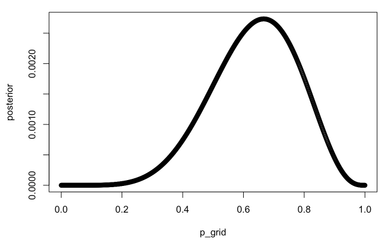
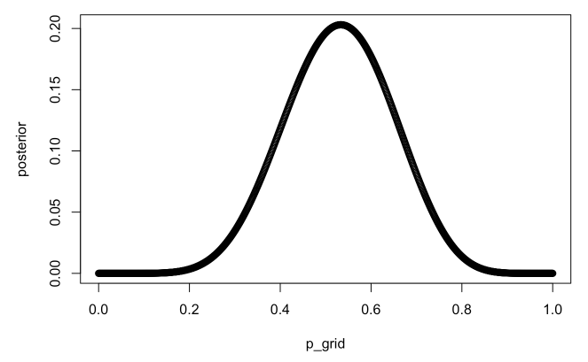
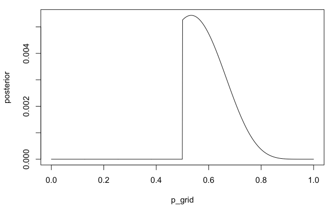
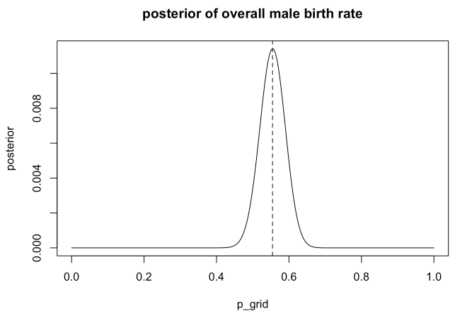
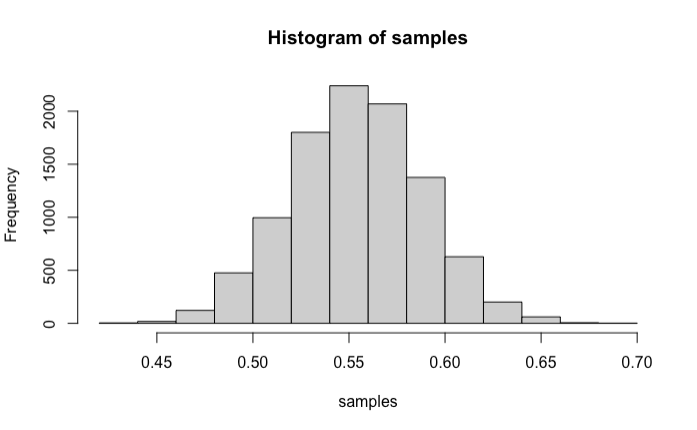
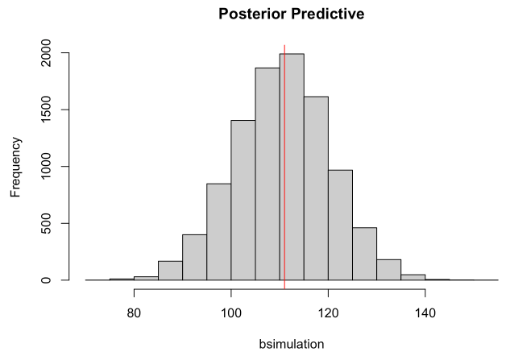
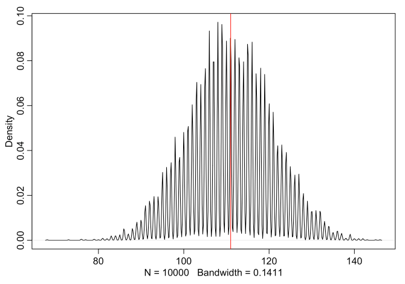
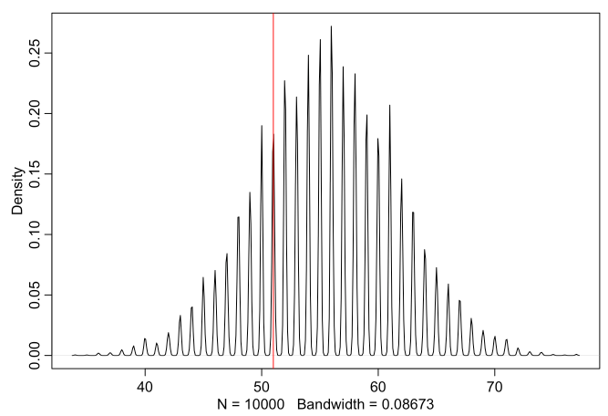
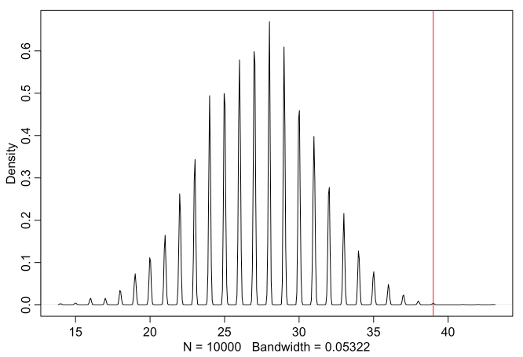

```{r setup, include=FALSE}
knitr::opts_chunk$set(echo = TRUE)
library(rethinking)
```

## Preliminary Code

``` r
p_grid <- seq(from=0, to=1, length.out=1000)
prior <- rep(1, 1000)
likelihood <- dbinom(6, size=9, prob=p_grid)
posterior <- likelihood * prior
posterior <- posterior / sum(posterior)
plot(p_grid, posterior)
```



``` r
samples <- sample(p_grid, prob=posterior, size=1e4, replace=TRUE)
```

## 3E1.

``` r
sum(samples < 0.2) / length(samples)
```

    ## [1] 5e-04

## 3E2.

``` r
sum(samples > 0.8) / length(samples)
```

    ## [1] 0.1181

## 3E4.

``` r
quantile(samples, 0.2)
```

    ##       20% 
    ## 0.5155155

## 3E5.

``` r
quantile(samples, 0.8)
```

    ##       80% 
    ## 0.7597598

## 3E6.

``` r
HPDI(samples, prob=0.66)
```

    ##     |0.66     0.66| 
    ## 0.5095095 0.7807808

## 3E7.

``` r
PI(samples, prob=0.66)
```

    ##       17%       83% 
    ## 0.4984985 0.7737738

## 3M1.

``` r
p_grid <- seq(from=0, to=1, length.out=1e3)
prior <- rep(1, length(p_grid))
likelihood <- dbinom(8, 15, prob=p_grid)
posterior <- likelihood * prior
plot(p_grid, posterior)
```



## 3M2.

``` r
samples <- sample(p_grid, prob=posterior, size=1e4, replace=TRUE)
HPDI(samples, prob=0.90)
```

    ##      |0.9      0.9| 
    ## 0.3343343 0.7177177

## 3M3.

Construct a posterior predictive check

``` r
samples <- sample(p_grid, prob=posterior, size=1e4, replace=TRUE)
w <- rbinom(1e4, size=15, prob=samples)
sum(w == 8) / 1e4
```

    ## [1] 0.1471

## 3M4.

``` r
w <- rbinom(1e4, size=9, prob=samples)
sum(w==6) / 1e4
```

    ## [1] 0.1732

## 3M5.

#### Redo 3M1.

``` r
p_grid <- seq(from=0, to=1, length.out=1000)
prior <- ifelse(p_grid < 0.5, 0, 1)
likelihood <- dbinom(x=8, size=15, prob=p_grid)
posterior <- likelihood * prior
posterior <- posterior / sum(posterior)
plot(p_grid, posterior, type="l")
```



#### Redo 3M2.

``` r
samples <- sample(p_grid, prob=posterior, size=1e4, replace=TRUE)
HPDI(samples, prob=0.9)
```

    ##      |0.9      0.9| 
    ## 0.5005005 0.7117117

#### Redo 3M3.

``` r
samples <- sample(p_grid, prob=posterior, size=1e4, replace=TRUE)
w <- rbinom(1e4, size=15, prob=samples)
sum(w == 8) / 1e4
```

    ## [1] 0.1522

#### Redo 3M4.

``` r
samples <- sample(p_grid, prob=posterior, size=1e4, replace=TRUE)
w <- rbinom(1e4, size=9, prob=samples)
sum(w == 6) / 1e4
```

    ## [1] 0.2337

## 3M6.

You want the 99% percentile interval of the posterior distribution of
*p* to be only 0.05 wide. This means the distance between the upper and
lower bound of the interval should be 0.05. How many times will you have
to toss the globe to do this?

``` r
real_water <- 0.7
p_grid <- seq(from=0, to=1, length.out=1e4)
prior <- rep(1, length(p_grid))

posteriors <- function(N) {
  likelihood <- dbinom(round(N*real_water), size=N, prob=p_grid)
  posterior <- likelihood * prior
  posterior <- posterior / sum(posterior)
  return(posterior)
}

for (i in 1:3000) {
  posterior = posteriors(i)
  samples <- sample(p_grid, prob=posterior, size=1e4, replace=T)
  interval <- PI(samples, prob=0.99)
  diff <- (interval[2] - interval[1])
  if (diff <= 0.05) {
    print(i)
    break
  }
}
```

    ## [1] 2133

# Hard Problems

``` r
data(homeworkch3)
```

# 3H1.

``` r
p_grid <- seq(from=0, to=1, length.out=1e3)
prior <- rep(1, length(p_grid))
likelihood <- dbinom(x=sum(birth1) + sum(birth2), size=length(birth1)+length(birth2), prob=p_grid)
posterior <- likelihood * prior
posterior <- posterior / sum(posterior)
max_p = p_grid[which.max(posterior)]
print(max_p)
```

    ## [1] 0.5545546

``` r
plot(p_grid, posterior,type="l", main="posterior of overall male birth rate")
abline(v=max_p, lty=2)
```



## 3H2.

``` r
samples <- sample(p_grid, size=1e4, replace=T, prob=posterior)
hist(samples)
```



``` r
print(HPDI(samples, prob=0.5))
```

    ##      |0.5      0.5| 
    ## 0.5305305 0.5765766

``` r
print(HPDI(samples, prob=0.89))
```

    ##     |0.89     0.89| 
    ## 0.4994995 0.6096096

``` r
print(HPDI(samples, prob=0.97))
```

    ##     |0.97     0.97| 
    ## 0.4774775 0.6266266

## 3H3.

``` r
samples <- sample(p_grid, size=1e4, replace=T, prob=posterior)
bsimulation <- rbinom(n=1e4, size=200, prob=samples)
hist(bsimulation, main="Posterior Predictive")
abline( v=sum(birth1)+sum(birth2) , col="red" )
```



``` r
p.samples <- sample(p_grid, size=10000 , replace=TRUE , prob=posterior)
bsim <- rbinom(10000 , size=200 , prob=samples)
# adj value makes a strict histogram, with spikes at integers
dens( bsim , adj=0.1 )
abline( v=sum(birth1)+sum(birth2) , col="red" )
```



## 3H4.

``` r
samples <- sample(x=p_grid, size=1e4, replace=T, prob=posterior)
bsim <- rbinom(n=1e4, size=100, prob=samples)
dens( bsim , adj=0.1 )
abline( v=sum(birth1), col="red" )
```



## 3H5.

``` r
female.first.borns <- length(which(birth1 == 0))
bsim <- rbinom(1e4, size=female.first.borns, prob=samples)
dens(bsim, adj = 0.1)
abline(v=sum(birth2[which(birth1 == 0)]), col="red")
```


The actual number of boys after girls is higher than predicted (with
assuming independence). This means that gender birth may not be
independent after all.


