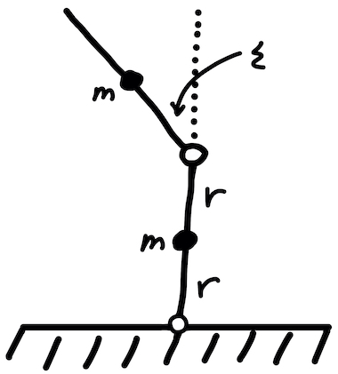

---

> Generalized Coordinates and Conservation Laws From the Lagrangian Formulation of Theoretical Mechanics

---

These are selected notes from a group of topics I find of particular interest. Although I assume some previous knowledge of classical mechanics from you, I still provide a brief overview of what the Lagrangian method is, where it comes from, how it relates to the more familiar Newtonian formulation, and how these beautiful laws of nature imply conserved quantities in everyday systems. The core of these notes include how we can simplify the Lagrangian method by observing conserved quantities by means of cyclic or "ignorable" generalized coordinates. The Lagrangian is invariant under variations of these types of coordinates. I will explain how cyclic coordinates and Lagrangian invariance imply conservation laws. There are several results that relate Lagrangian invariance and conserved quantities and they are referred to as Noether's theorem. I am happy to share what I have learned with you!

# Overview
Let's start with simple laws of motion. They describe how mechanical
systems evolve in time given certain conditions and constraints. Consider
yourself standing on the St. Louis Arch (Gateway Arch, whose width *and* height are 630 ft.) in the name of science. You hold out an apple with your hand and drop it so that it is falling towards the Earth. We can predict, for example, where the apple will be at some later time by using an equation of motion. Say we took air resistance into account or that it then falls into a huge pool of oil or dropping a water balloon instead that oscillates in free space or dropping a single water droplet while it's raining.
Does the rate at which the water droplet accumulate "water-mass" increase? And if this drop then fell into the pool of oil... and if the pool sits on a spring... or two springs... or an infinite number of springs, etc. We can study a slew of systems using equations of motion (and some canny logical intuition). Newtonian and
Lagrangian mechanics are just a couple ways of obtaining these types of descriptions of systems we experience everyday.

The most obvious difference between these methods is that Newtonian method utilizes the external *forces* of a system and how they apply in some defined coordinate plane while the Lagrangian focuses on the *energy* the system
is experiencing. Now we can begin talking about the Lagrangian and how related these methods actually are.

The Lagrangian can be written as:

$$ \mathcal{L} = T - U$$

The kinetic energy $T$ and the potential energy $U$ are used to make the Lagrangian and
the Lagrangian is used to find the equations of motion with something called the *Lagrange* equations. It can be written as:

$$\frac{\partial \mathcal{L}}{\partial q_i}=\frac{d}{dt}\frac{\partial \mathcal{L}}{\partial \dot{q}_i}$$

where $q_i$ are the generalized coordinates that we are using. Since this is still the overview, I will briefly describe where the *Lagrange* equation comes from.

The *Lagrange* equation is a subset of a far broader area of mathematics called the *Calculus of Variations* or *Variational Calculus*. It involves finding the maximum and minimum of a quantity that can be expressed as an integral. The general form of what is called the *variational problem* is:

$$S=\int_{x_1}^{x_2} f[y(x), y'(x), x]dx$$

The important part is finding the equation $y(x)$ such that the $S$ integral is stationary
(which means infinitesimal variations of the path $y(x)$ doesn't change the value of the
integral). After a tedious derivation, we are left with what is called the
*Euler-Lagrange* equation. Remember that this result is purely mathematical and hasn't
been applied to our physics world quite yet.

We can talk about these variational methods for pages but let's get to the meat of it
all. The reason why variational calculus and the Euler-Lagrange equation are so
important is because when the function $f[y(x), y'(x), x]$ within the integral is the Lagrangian (defined at the top of the page), the integral is called the *action* integral and the function that makes the *action* integral *stationary*
is the equation of motion of the particle in question.

This result is stated in what is called *Hamilton's Principle*.
It tells us that if we know the energy (and therefore the Lagrangian) of a
system, then we can know about its motion and how it evolves through time.
*Hamilton's Principle* is as follows:
 
## **Hamilton's Principle**

*The actual path which a particle follows between two points 1 and 2 in a given time interval, $t_1$ to $t_2$, is such that the action integral*

$$S=\int_{t_1}^{t_2} \mathcal{L} dt$$

*is stationary when taken along the actual path.*

Now we may go back to the *Lagrange* equation and see that it must provide us with
the path that an actual particle will travel that experiences the forces and energy described by the Lagrangian.
$$\frac{\partial \mathcal{L}}{\partial q_i}=\frac{d}{dt}\frac{\partial \mathcal{L}}{\partial \dot{q}_i}$$

If what has been written so far seems vague or a bit generalized, it is because this was
intended to be more of a reminder than an introduction. Let's finish this overview with
the relationship between the Newtonian and Lagrangian formulations. 
The equations that are obtained by these methods must be equal; physics does not change
depending on the language we use to describe it; they really are one and the same. Just because
Newton's laws are usually explicitly written in terms of force doesn't mean we
can't express it in terms of another quantity like momentum for example:
$$F = ma = m\dot{v} = \dot{p}$$
Let's not forget how related force and energy really are:

$$\Delta T = T\_2 - T\_1 = \int_{1}^{2}\textbf{F} \cdot d\textbf{r}$$

$$U(\textbf{r}) = -\int_{r_0}^r F(\textbf{r}') \cdot d\textbf{r}'$$
To relate Lagrangian and Newtonian methods more directly:

## Euler-Lagrange Equation

$$\frac{\partial \mathcal{L}}{\partial q_i}=\frac{d}{dt}\frac{\partial \mathcal{L}}{\partial \dot{q}_i}$$
$$\frac{\partial \mathcal{L}}{\partial q_i} = F_i\ \ \ and\ \ \ \frac{\partial \mathcal{L}}{\partial \dot{q}_i} \equiv p_i$$
These are referred to as generalized forces and generalized momenta. We may start our discussion of generalized ignorable coordinates and conservation laws now!

**Quick Fun Fact!** There also exists a Hamiltonian formulation of Classical
Mechanics that takes advantage of its own coordinate system called *Canonical Coordinates*.

## Generalized Coordinates
Generalized momenta and generalized forces are not the same thing as the familiar
force and momentum we are used to. We can still relate momentum and force in the
usual manner:
$$F_i = \frac{d}{dt}p_i,$$
except these are understood to be defined using generalized coordinates. The fact that
*generalized force* $=$ *rate of change of generalized momentum* should not be surprising.
A direct way to think of generalized coordinates is to describe the complete
motion of a system in the fewest number of coordinates. Consider a pendulum bob for one
moment (yes, another pendulum).

We have a choice of using Cartesian coordinates to describe the motion of this
bob or any other coordinate system we can dream up. The downside of using
Cartesian coordinates $(x,y)$, is that $x$ and $y$ must constantly compensate one another to assure the length L remains constant. We can imagine all the combinations of values that satisfy $x^2+y^2-L^2=0$. Long story short, spherical (or polar) coordinates $(r, \theta, \phi)$ are the most appropriate for this problem for
obvious symmetrical advantages and can be considered the generalized coordinates that define our system.

Now that we have mentioned what generalized coordinates are, we can gain more insight
on what generalized momenta is. Ordinary momentum by definition is $p = mv$ where $v$ is
one time derivative away from a position variable: $p = m (\dot{x}+\dot{y}+\dot{z})$.
So we can easily see that generalized momenta is simple the mass of an object times the
time derivative of its generalized position vectors! Simple! Generalized force can be found the same way except with two time derivatives. $F_t$ in the Figure 1 is the
generalized force of the pendulum system. This pendulum can escape from the x-y grid universe and be thought of as moving along one generalized coordinate, $\theta(t)$. (The length of the pendulum, L, if fixed but if it weren't, $r(t)$ could be another generalized coordinate used to describe the system).

## Cyclic Coordinates
When the Lagrangian of a system is independent of a generalized coordinate $q_i$, that
coordinate is sometimes called a *cyclic* or *ignorable* coordinate.
Saying the Lagrangian is independent of a particular variable is exactly what it
sounds like, neither the kinetic nor the potential energy depend on this quantity.
This leads directly to the fact that there exists a conserved quantity!

We can generally express a Lagrangian that is independent of some generalized
coordinate $q_2$ as:
$$\mathcal{L}=\mathcal{L}(q_1, q_3, q_4, \cdots, \dot{q}_1, \dot{q}_2, \dot{q}_3, \dot{q}_4, \cdots, t)$$

What this means exactly, is that the generalized momentum that corresponds to $q_2$ is
conserved. This can be written as:
$$\frac{d}{dt}\frac{\partial \mathcal{L}}{\partial \dot{q}_2} = \frac{\partial \mathcal{L}}{\partial q_2} = 0$$
$$\frac{\partial \mathcal{L}}{\partial \dot{q}_2} = \kappa$$ where $\kappa$ is constant. We can say that this system exhibits conservation of angular momentum!

This makes solving equations of motion using Lagrangian even easier than before!

Let's take advantage of this property by examining the $\mathcal{L}$ of a standard classical mechanics
problem (one of which never gets old). It is stated as follows:
 
**Problem** *A mass $m$ is free to slide on a frictionless table and is connected, via a string that passes through a hole in the table, to a mass $M$ that hangs below. Assume that $M$
moves in a vertical line only, and assume that the string always remains taut. Figure 2 shows a moment in time of this situation.*

The Lagrangian is as follows:
$$\mathcal{L}=T-U$$
$$\mathcal{L}=\frac{1}{2}M \dot{r}^2+\frac{1}{2}m(\dot{r}^2+r^2\dot{\theta}^2)+Mg(l-r)$$
The important thing to notice about this expression is that there is no $\theta$ variable
in it anywhere. The Lagrangian is said to be invariant under variations of the generalized
coordinate $\theta$. The important conclusion to take away from this is that the momentum that corresponds to $\theta$ is conserved or in
this case, the angular momentum $mr^2\dot{\theta}$. Therefore without much investigating we can quickly see that $\frac{d}{dt}(mr^2\dot{\theta})=0$. This comes directly from the *Euler-Langrange* equation obtained by varying $\theta$:

$$\frac{\partial \mathcal{L}}{\partial \theta}=\frac{d}{dt}\frac{\partial \mathcal{L}}{\partial \dot{\theta}}$$
$$0 = \frac{d}{dt}(mr^2\dot{\theta})$$

The *E-L* equation that comes from varying $r$ is:
$$\frac{\partial \mathcal{L}}{\partial r}=\frac{d}{dt}\frac{\partial \mathcal{L}}{\partial \dot{r}}$$
$$(M+m)\ddot{r}=mr\dot{\theta}^2-Mg$$

## Conservation of Energy
Energy is also another quantity that is often conversed in these types of mechanical problems. We will introduce an important claim that touches on this conservation law. First let's give a definition of *energy* in terms of the *Lagrangian*:
$$E \equiv (\sum_{i=1}^{N} \frac{\partial \mathcal{L}}{\partial \dot{q}_i} \dot{q}_i) - \mathcal{L}$$
This may seem random to define the energy in such a way but don't worry too much about it for now. Without going into too much detail, this result is far from random. In fact, there is a rigorous mathematical reason, called the theory of Legendre transforms, that explains why energy can be written in this form. You see this often in Hamiltonian mechanics since the Hamiltonian is simply the total energy of the system: $T+U$.

Now we may introduce the claim mentioned earlier:

*If $\mathcal{L}$ has no explicit time dependence (that is, if $\frac{\partial \mathcal{L}}{\partial t} = 0$), then E is conserved (that is, $\frac{dE}{dt} = 0$), assuming that the motion obeys the E-L equations.*

Without proving it, the following relation summarizes this claim:
$$\frac{dE}{dt}=-\frac{\partial \mathcal{L}}{\partial t}.$$

## Applications
I programmed this nonlinear double pendulum with Mathematica (Wolfram Language)

## Practice Problem

Here is a fun problem you can practice with.

Two massless sticks of length $2r$, each with a mass $m$ fixed at its middle, are hinged at an end. One stands on top of the other, as shown in above. The bottom end of the lower stick is hinged at the ground. They are held such that the lower stick is vertical, and the upper one is tilted at a small angle $\epsilon$ with respect to the vertical. They are then released. At this instant, what are the angular accelerations of the two sticks? Work in the approximation where $\epsilon$ is very small.

## References

* `Morin, David. Introduction to classical mechanics: with problems and solutions. Cambridge University Press, 2008.`