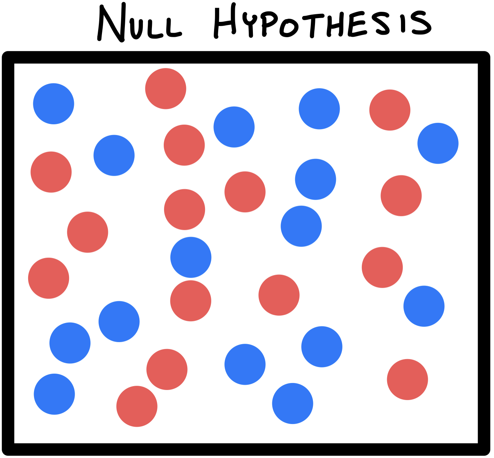
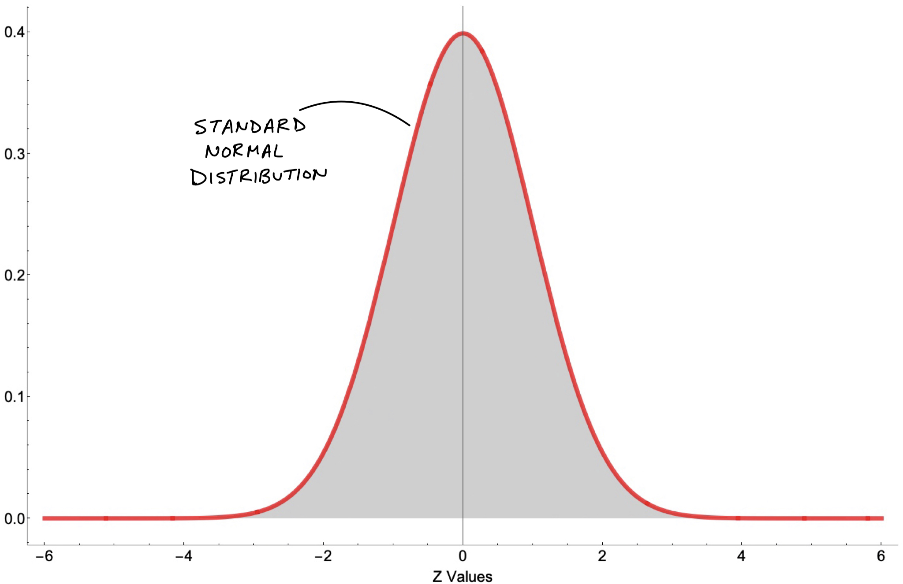
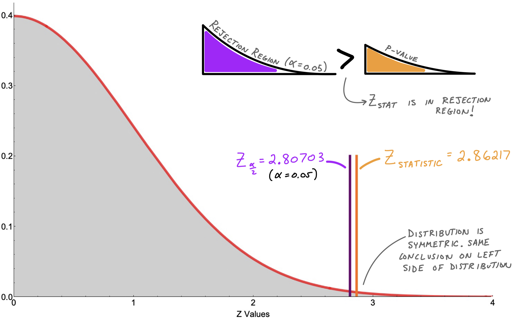

# What is a P-Value! (in Hypohtesis Testing)

An average person might say p-values are of utmost importance in a student's statistical toolbox. However, while teaching statistics and probability, I have noticed its subtle definition and conceptual underpinnings being grossly under-emphasized. This note may help clarify what a p-value is and how we use it to make decisions.

To explain what a p-value is, I will start with the "**p**". What does it stand for? If you're thinking *probability*, then you're correct. The tricky question becomes: *the probability of what?* One definition might be: a p-value is the probability of getting an observed value of the test statistic (or more extreme value), given that the null hypothesis is true. Sounds confusing, I know. Variants of this definition are also used but generally this language doesn't help if you're actually trying to learn it. Let's break this topic down with the use of a story.

-------------------------

# Conceptual Understanding!

* Imagine a container of  *RED* and  *BLUE* marbles (statistics is the reason marbles are still relevant in life). This container of marbles can represent our *population*. Let's say we *assume* there are an equal number of each color. The word *assume* means that there is an initial beleif. We give this initial belief a special name: the *Null Hypothesis*.

* In order to test our *Null Hypothesis*, we collect a *sample*. *Sample* is another term statistics also often uses; it's just a subset of our population.

* If our sample consists of nothing but ** *BLUE*** marbles, we could ask the question: How likely is it we would get this all ** *BLUE*** sample *given* that our initial belief was that ** *RED*** and ** *BLUE*** are of equal number in the container?
* This is reflected by the p-value! The p-value is the probabiliy of seeing this sample given our initial belief (or in other words, given our *Null Hypothesis*).
* If our p-value is low, then we have evidence *AGAINST* our Null Hypothesis and we say that we "reject our Null Hypothesis in favor for the *Alternative Hypothesis*. The *Alternative Hypothesis* in our marble example is that the ** *RED*** and ** *BLUE*** are not of equal number.
* If, on the other hand, our p-value is high, then we don't have a good enough reason to reject our initial belief. In this case we "fail to reject our Null Hypothesis.
* We need some way of determining what is *low* and what is *high* when it comes to P-values. This is what we call $\alpha$.

# Making More Concrete

### Let's make up a similar example

**QUESTION:** It is believed that there are an equal number of ** *RED*** and ** *BLUE*** marbes in a jar. A sample of size 80 is taken in which 66\% of marbles are ** *BLUE***. Should we keep our initial belief?

### Solution:

* Let's say our initial belief of the proportion is denoted as $\pi_0$ (Null Hypothesis). This means: $\pi_0 = 0.50$
* We model this proportion of blue marbles in our sample as a random variable. $\hat p$ whose mean is $0.66$.
* We can assume this random varibles $\hat p$ follows a Normal Distribution so long as $n \cdot p \ge 10$ and $n \cdot (1-p) \ge 10$. This is referred to as the Rule of Sample Proportions. If these assumptions are not true, then we may approximate our distribution with a Binomial.
* $n$ is the sample size and $p$ is our proportion which we will approximate with $\hat p$ (in this case: 66\%)
* If this assumption checks out, we can calculate our z-statistic:

$$Z_{statistic} = \frac{\hat p - \pi_0}{\sqrt{\frac{\pi_0 (1 - \pi_0)}{n}}}$$

* The denominator, $\sqrt{\frac{\pi_0 (1 - \pi_0)}{n}}$, is the standard error of the sampling distribution.

When we set $\pi_0 = 0.5$, $\hat p = 0.66$, and $n = 80$:

$$Z_{statistic} = \frac{0.66 - 0.50}{\sqrt{\frac{0.50 (1 - 0.50)}{80}}} = 2.86217$$

* What this allows us to do is draw a Normal Distribution and see where the $Z_{statistic}$ lies.
* First, let's remember what a Standard Normal Distribution looks like:

* We want to compare this $Z_{statistic}$ for a $Z_{critical}$:

$$Z_{critical} = Z_{\frac{\alpha}{2}} = Z_{\frac{0.05}{2}} = 2.80703$$

where we use significance level $\alpha = 0.05$.

* Let's Zoom in to compare these numbers and see where the P Value comes in

# Conclusion

* Since $Z_{statistic}$ is greater than $Z_{\frac{\alpha}{2}}$ (which we sometimes call $Z_{critical}$), then we can immediately say that our p-value is less than $\alpha$.
* Remember what a low p-value tells us: the probability of seeing this sample given our intiial belief is LOW! Statistically sigificanly low!
* We simply reject the Null Hypothesis. We say we have enough evidence to show that it is likely untrue that there are an equal number of ** *RED*** and ** *BLUE*** marbes in the 

# WE DID IT!

* Try some practice problems on your own
* There is some controversy around the merits of p-values --- think about why this might be
