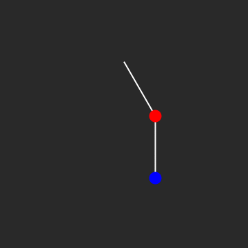

# (Very) Beginnings of Quantum Mechanics

The Schrodinger Equation is a natural entry way into the quantum realm from classical mechanics. The story starts with a particle of mass $m$ constaine to the $x$-axis subject to a force, $F(x, t)$. A productive goal would to be to determine the function $x(t)$.

*If $\mathcal{L}$ has no explicit time dependence (that is, if $\frac{\partial \mathcal{L}}{\partial t} = 0$), then E is conserved (that is, $\frac{dE}{dt} = 0$), assuming that the motion obeys the E-L equations.*

Without proving it, the following relation summarizes this claim:
$$\frac{dE}{dt}=-\frac{\partial \mathcal{L}}{\partial t}.$$

## Applications
I programmed this nonlinear double pendulum with Mathematica (Wolfram Language)

## Practice Problem

Here is a fun problem you can practice with.

Two massless sticks of length $2r$, each with a mass $m$ fixed at its middle, are hinged at an end. One stands on top of the other, as shown in above. The bottom end of the lower stick is hinged at the ground. They are held such that the lower stick is vertical, and the upper one is tilted at a small angle $\epsilon$ with respect to the vertical. They are then released. At this instant, what are the angular accelerations of the two sticks? Work in the approximation where $\epsilon$ is very small.

## References

* `Morin, David. Introduction to classical mechanics: with problems and solutions. Cambridge University Press, 2008.`