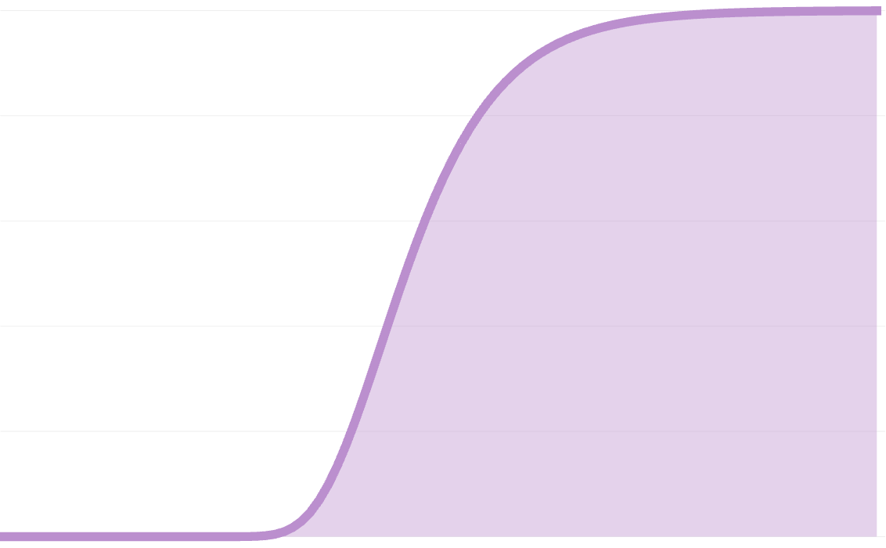
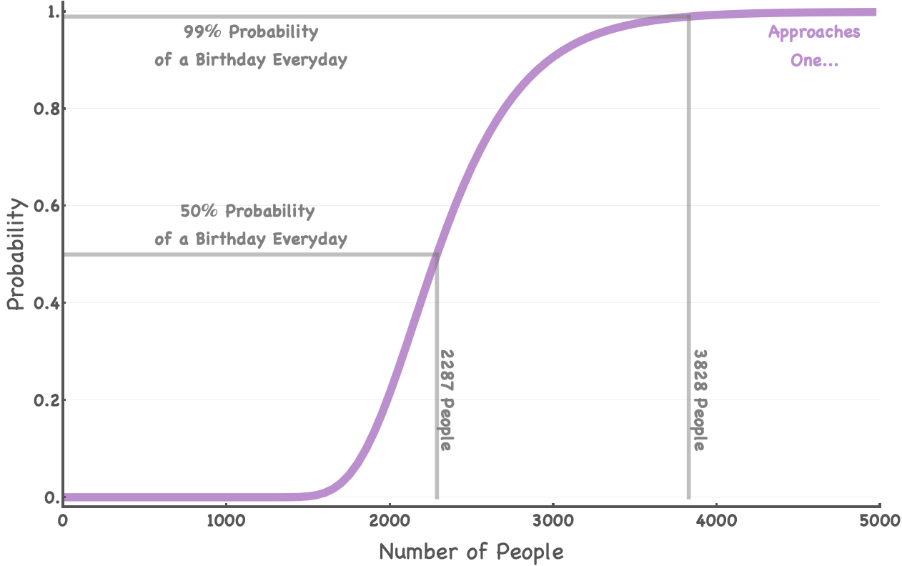
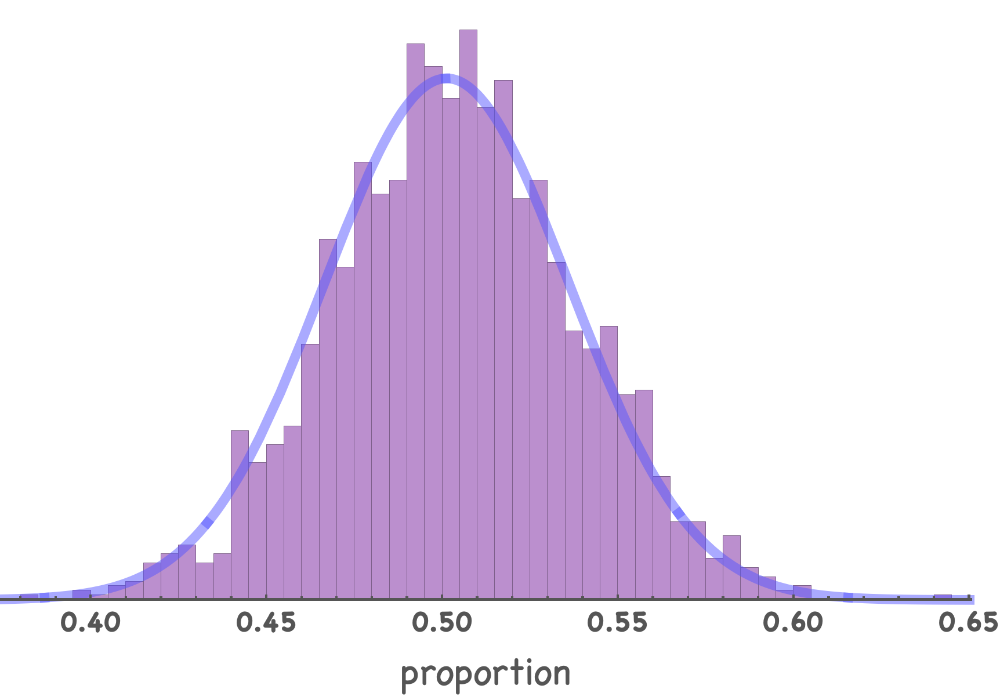

---

## Motivation

Consider this scene from a Seinfeld episode ([LINK](https://www.youtube.com/watch?v=unxHTEdye2A) if you'd like to watch the short clip)
> **Coworker**: "Elaine? Cake?"

> **Elaine**: "Oh, no thanks"

> **Coworker**: "It's Walter's special day!"

> **Elaine**: "You know, there's 200 people who work in this office. Everyday is somebody's special day."

Firstly, if by "special day" she means birthdays, then this of course cannot be true since there are 365-ish days in a year and only 200 people who work in the office. However, suppose there were 365 people in the office.

**What is the probability of every single day being someone's birthday?**

How might this probability change as the number of people increase to say 3000 people? Or if the number of days in the year decreases to 100 days?

These questions are easy to ask however their answers I found to be somewhat abstruse. So let's dig into it!

---

## Building Intuition

1. Assuming 365 days in a year, we know that with only 200 people the probability that there's a birthday everyday is zero! (not to be confused with $0!=1$ 🤖) The point is: we need at least 365 people for this problem to make any sense.

2. **Extremes**: with 365 people, we might expected the probability of a birthday everyday being very low. Furthermore, we can intuit that the probability of a birthday everyday may asymptotically reach 100% as the number of people tends to infinity $(n \rightarrow \infty)$.

3. For the time being, we can assume birthdays are completely random and this is not a leap year. We know in reality that birthdays are not random but rather tend to favor some months more than others, etc.

---

## Framing the Problem with Expectations
At first glance, this can be thought of in terms of the well-known **Coupon Collector's Problem** which states:

> Given n coupons, how many coupons do you expect you need to draw with replacement before having drawn each coupon at least once?

In our case, coupons are the distinct days in the year. This expected value isn't the final answer we want but let's see how this works anyways. (may be skipped if you're not interested)

* Let $T$ be a random variable of the number of people we need to inspect to collect all $n$ distinct days in the year. We can imagine a line of individuals with random birthdays and one-by-one we check off the days in the year.

* Let $t_i$ be the number of people needed to collect the $i^{th}$ day after $i-1$ days have already been collected. Therefore, $T = t_1 + \cdots + t_n$.

* The probability of collecting a new $i^{th}$ day is $p_i = \frac{n - (i - 1)}{n} = \frac{n - i + 1}{n}$.

* Keep in mind that for each new day, the number of days we need to see before seeing a new one follows a *geometric distribution* (a distribution over the number of trials needed before seeing the first success -- this can be extended with the negative binomial but that's beyond our scope).
* The expectation value of the *geometric distribution* is $\frac{1}{p}$. So in this case, it'd be $\frac{1}{p_i} = \frac{n}{n-i+1}$.

* The *Linearity of Expectations* says that: $E(T) = E(t_1 + \cdots + t_n) = E(t_1) + \cdots + E(t_n)$.

* This continues with:
$$= E(t_1) + \cdots + E(t_n)$$
$$= \frac{1}{p_1} + \cdots + \frac{1}{p_n}$$
$$= \frac{n}{n} + \frac{n}{n - 1} + \cdots + \frac{n}{1}$$
$$= n \cdot \left(\frac{1}{1} + \frac{1}{2} + \cdots + \frac{1}{n}\right)$$
$$= n \cdot H_n$$

where $H_n$ is the $n^{th}$ *Harmonic Number*.

Since we're assuming 365 days in a year:
$$E(T) = 365 \cdot \sum_{k=1}^{365} \frac{1}{k} \approx 2364.64602343634$$

The expected value was found using Mathematica:

```Mathematica
365 Sum[1/k, {k, 1, 365}] // N
```

---

## Framing the Problem with Probabilities

I believe the best place to start is to think about this simple ratio:
$$P(B | n, k) = \frac{f(n, k)}{g(n, k)}$$

where $n$ is the number of people, $k$ is the number of days in a year, and $B$ is the event that there is at least one birthday everyday of the year.

* $f(n, k)$: number of ways of distributing $n$ distinct people among $k$ distinct birthdays, with each days containing at least one person.
* $g(n, k)$: number of ways of distributing $n$ distinct people among $n$ distinct birthdays, allowing for the possibility of having one or more days with no people at all.

#### 365 people (n = k)
Consider we have exactly 365 people, what is the probability that everyone has a distinct birthday? To jump to the point: there are $365!$ ways to rearrange people's **distinct** birthdays and there are $365^{365}$ ways that birthdays can be assigned among 365 people, unrestricted.

In terms of our functions $f$ and $g$ above, we may say that:
$$f(n, k) = n!$$
$$g(n, k) = k^n$$

$$P(B | n=365, k=365) = \frac{n!}{k^n} = \frac{365!}{365^{365}} = 1.4549552156187034034 \cdot 10^{-157} \approx 0$$

This shows that it's VERY unlikely that there's a birthday everyday given 365 people.

#### Recursive Solution $(n \ge k)$

* $g(n, k)$: In this case, $g(n, k)$ remains the same as before: $k^n$. In other words, there are still the same number of ways to rearrange $k$ birthdays to $n$ people without any kinds of restriction. This is the easy one.
* $f(n, k)$: It becomes more complicated when we consider the restriction that no days are left empty. To tackle this, we'll consider how many ways there are to rearrange $n$ into $k$ without restriction (basically $g(n, k)$) and subtract the number of arrangements there are with one day empty then subtract the number of arrangements there are with two days empty, and so on.

The "so on" above can be written as:

$$f(n, k) = k^n - {k \choose 1} \cdot f(n, 1) - {k \choose 2} \cdot f(n, 2) - \cdots - {k \choose k - 1} \cdot f(n, k - 1)$$

* Note that we need the binomial coefficients because there are a combinatorial number of ways to rearrange these *empty* days.
* Note that the last term means that everyone has the *same* birthday and that day could be any of the $k$ days on the calendar.

Written more compactly:

$$f(n, k) = k^n - \sum_{i = 1}^{k - 1}{k \choose i} f(n, i)$$

where k > 1 and ${k \choose i} = \frac{k!}{i! (k - i)!}$

$$\therefore P(B | n, k) = \frac{f(n, k)}{g(n, k)} = \frac{k^n - \sum_{i = 1}^{k - 1}{k \choose i} f(n, i)}{k^n}$$

#### "The Venetian" Solution

The Scottish mathematician James Stirling was nicknamed "The Venetian". He was a friend of Isaac Newton and well known for important advances to the theory of infinite series and infinitesimal calculus. His most important work is his book, **Methodus Differentialis** (1730) where he includes the asymptotic formula for $n!$ (for the interesed reader).

The point here is that he is also well known for the **Stirling Numbers** used in the field of combinatorics. The **Stirling number of the second kind** is the number of ways to partition a set of $n$ labeled objects into $k$ unlabeled non-empty subsets and is denoted by ${n \brace k}$.

This helps us immensely since this is a key idea in the $f(n, k)$ that we found difficulty with above. The Stirling number of the second kind may formally be defined as:

$${n \brace k} = \frac{1}{k!} \sum_{i=0}^{k} (-1)^i {k \choose i}(k - i)^n$$

The main consideration for our problem is that the days of the year are actually labeled and we care what day someone's birthday lands on. In order to correct for this we add an extra $k!$ into our calculation. Therefore:
$$f(n, k) = k! {n \brace k}$$
and of course, $g(n, k) = k^n$.

This leaves us with the final probability calculation:

$$\therefore P(B | n, k) = \frac{f(n, k)}{g(n, k)} = \frac{k! {n \brace k}}{k^n} = \frac{1}{k^n}\sum_{i=0}^{k} (-1)^i {k \choose i}(k - i)^n$$

This is a cleaner solution, albeit harder to understand at a glance.

#### Plotting Probabilties



---

## Simulation

We have the advantage of being able to create a simulation without having gone through the mathematics. The following code was done using Mathematica.

* `n`: number of people
* `k`: number of days in the year (possible birthdays)
* `s`: sample size (number of groups of size n for simulation)
* `x`: number of experiments to run to get final distribution

```mathematica
f[n0_, k0_, s0_, x0_] :=
 Module[{n = n0, k = k0, s = s0, numExp = x0, probList = {}},
  Do[
   birthdays = RandomInteger[{1, k}, {s, n}];
   uniqueBirthdays = 
    DeleteDuplicates[birthdays[[#]]] & /@ Range[Length[birthdays]];
   countAtLeastOneEachDay = 
    CountsBy[uniqueBirthdays, ContainsAll[#, Range[1, k]] &];
   counts = 
    If[KeyExistsQ[countAtLeastOneEachDay, True], 
     countAtLeastOneEachDay[True], 0];
   AppendTo[probList, counts/s // N], {i, numExp}];
  Return[probList]
  ]
```

* Suppose $n = 2287$ people and $k = 365$ days in the year. The plot below shows the proportion of experiments that result in "birthday everyday" years. The mean of the values below is $\bar p = 50.116$% and the theoretical probability is $p = 50.0371$%.




---

## References
* [Coupon Collector's Problem](https://en.wikipedia.org/wiki/Coupon_collector%27s_problem)
* [Stirling Number of the Second Kind](https://en.wikipedia.org/wiki/Stirling_numbers_of_the_second_kind)
