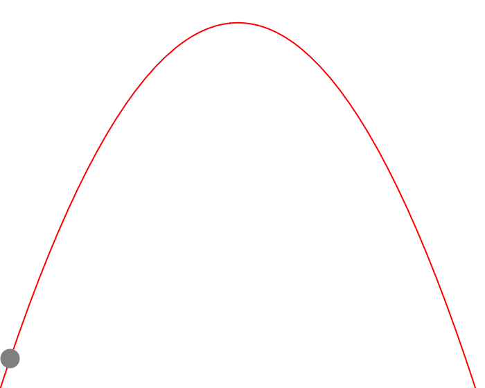
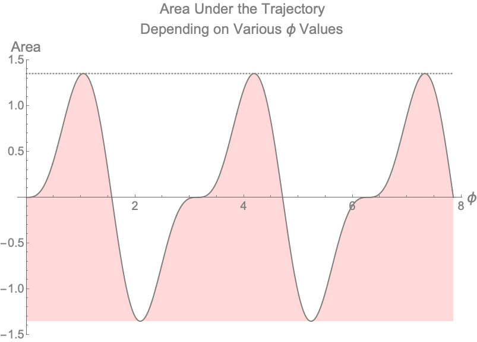

opt---
title: "optimizing trajectory angle"
author: "Eric Peña"
date: 2019-12-13T00:00:00-07:00
description: "Physics Problem –– Optimizing Trajectory Angle"
type: non-technical_note
draft: false
---

## Introduction

I had the pleasure of teaching physics for the Pre First-Year Academic and Career Engagement [(PREFACE)](https://mep.engineering.osu.edu/preface-summer-bridge-program) Program. These are students that graduated high school and are transitioning into college to study engineering. The following is a problem I gave my students as a challenge question on their final. Many students found this problem interesting and we had a long discussion about the power of learning theoretical mechanics for the future of their respective degrees.

## The Problem
A ball is thrown at speed $v_o$ from zero height on level ground. At what angle $\phi$ (from horizontal) should the ball be thrown such that the area under the trajectory is maximized? (Assume no air resistance)

## Visualize the Problem
It's important to visualize the problem at hand. We can ask questions such as:
1. How does the shape of trajectory change with different $\phi$?
2. How does the area under the curve change with changing $\phi$?

Let's take a look at what this might look like.

Figure 1 — Visualizing Trajectory of Ball

## The Physics

In order to find the area underneath a curve, we can use calculus. Generally, the area of an arbitrary curve in our x—y plane is:

$$\int_{x_o}^{x_f}y dx$$

For projectile motion, x and y are expressed as:

$$x = x(t) = v_{o,x} t = v_o cos(\phi) t$$

$$y = y(t) = v_{o,y} t - \frac{1}{2}g t^2 = v_o sin(\phi) t - \frac{1}{2} g t^2$$

We can use these expressions to integrate the curve in order to find the area. Note that x and y are both in terms of t, this is called parameterization because we're turning a multi-variable equation into an equation with one "parametric" parameter, t. Let's first talk about the integral bounds of the new integral that is now in terms of t:

It makes sense to allow time to start at zero:
$$t_o = 0$$

Now to find final time, let's find where the ball hits the ground again:

$$v_o sin(\phi) t - \frac{1}{2} g t^2 = 0$$
$$t_{final} = \frac{2 v_o sin(\phi)}{g}$$

To find $dx$, we can take a time differential:
$$dx = v_o cos(\phi) dt$$

## Putting The Pieces Together To Find Area

$$\int_{0}^{\frac{2 v_o sin(\phi)}{g}} (v_o sin(\phi) t - \frac{1}{2} g t^2)(v_o cos(\phi) dt)$$

Let's think about how the area under the curve changes with changing $\phi$. This will help us answer our first question (1).

Figure 2 — Visualizing Trajectory of Ball With Changing $\phi$

Solving this integral gives:

$$\frac{2 v^4 cos(\phi) sin^3(\phi)}{3g^2}$$

## Putting In Numbers

To move forward with our analysis, let's put in some numbers.

Let $v_o = 5 \frac{m}{s}$ and $g = 10 \frac{m}{s^2}$

In this case, the integral becomes:

$$\frac{25}{6}cos(\phi) sin^3(\phi)$$

To answer our second question (2) that asks how does the area under the curve change with changing $\phi$, we can draw the plot below.

Figure 3 — Visualizing Area Under Trajectory of Ball With Various Values of $\phi$

## The Answer
To find the answer we take the derivative of the equation that tells us the area with respect to angle, set it equal to zero, then solve for $\phi$.

$$\frac{d}{d\phi}\frac{25}{6}cos(\phi) sin^3(\phi) = 0$$

Which becomes:

$$\frac{25}{2} cos^2(\phi) sin^2(\phi) = \frac{25 sin^4(\phi)}{6}$$

After some algebra, the answer becomes:

$$\phi = \frac{\pi}{3} = 1.0472$$

Although the answer we are looking for is $\frac{\pi}{3}$, there are other non-intuitive, non-physical answers that technically satisfy our problem as well. For example, $\frac{2\pi}{3}$ is another answer. This would mean that we threw the ball behind us. $(-\frac{2\pi}{3})$ is another answer which would mean we threw the ball behind us and into the ground and gravity was reversed - this wouldn't make much physical sense. If we allowed the plot above to continue, we get a better picture of what is happening.

Figure 4 — Visualizing Area Under Trajectory of Ball With Various Values of $\phi$ for $0 < \phi < \frac{5\pi}{2}$

## Final Questions to Answer
For completion, let's answer some basic questions about our ball given the initial conditions states above now that we know the optimal angle $\phi$.

#### How long does it take the ball to land?
$$t = \frac{2 v_o sin(\phi)}{g} = \frac{\sqrt3}{2} = 0.866025\ s$$

#### How far does the ball go?
$$x = v_o cos(\phi) t = \frac{5\sqrt3}{4} = 2.16506\ m$$

#### How high does the ball go?
$$y = v_0 sin(\phi) \frac{t}{2} - \frac{g}{2} \left(\frac{t}{2}\right)^2 = \frac{15}{16} = 0.9375\ m$$

#### What is the area under the curve that is maximized at $\phi = \frac{\pi}{3}$?
$$A = \frac{25}{6} cos(\phi) sin^3(\phi) = \frac{25 \sqrt3}{32} = 1.35316\ m^2$$

Figure 5 — Ball Trajectory at Angle $\frac{\pi}{3}$

