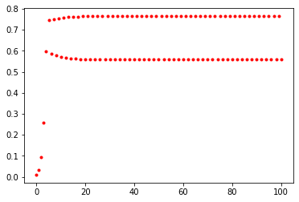

## Logistic Map

The famous logistic map is a recurrence relation or polynomial mapping of degree 2. It is a nonlinear difference equation capable of capturing complex nonlinear dynamical behavior including chaos. This map was popularized by the biologist Robert May in a [Nature article](https://www.researchgate.net/publication/237005499_Simple_Mathematical_Models_With_Very_Complicated_Dynamics) written in 1976. Sadly, Robert May has passed away recently on April 28, 2020. The equation is as follows:

$$x_{n+1} = r x_n (1 - x_n)$$

The parameter $r$ controls the behavior of the system. It turns out that $r=3.6$ is starting to reach the point of chaos.

## Preamble


```python
from pylab import *
```

## Defining Logistic Map


```python
def f(x, r):
    return r*x*(1-x)
```

## Period Doubling Bifurcation $(r = 3.1)$


```python
x = 0.01
r = 3.1
xdata = [x]
for t in range(100):
    x = f(x, r)
    xdata.append(x)
plot(xdata, 'r.');
```


    

    


## Creating Bifurcation Diagram


```python
rvalues = []
xvalues = []
for r in linspace(2.5, 3.7, 500):
    x = 0.01
    for t in range(200):
        x = f(x, r)
        if t > 100:
            rvalues.append(r)
            xvalues.append(x)
        
plot(rvalues, xvalues, 'r.', alpha = 0.05);
```


    

    

