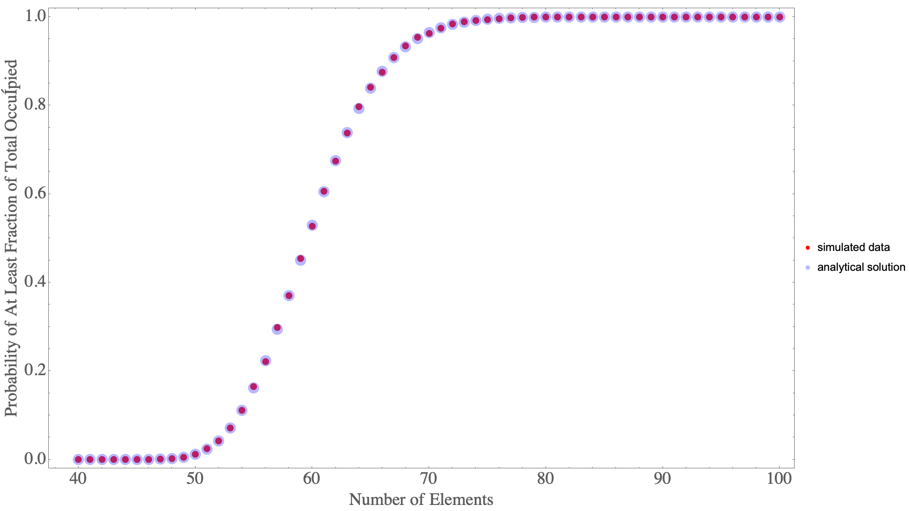

---

#### Full Report (Click Link): [[LINK](mod_coupon/MCCP.pdf)]

## Introduction

In probability theory, the coupon collector's problem refers to the mathematical analysis of collecting every distinct kind of element when randomly choosing elements with replacement. Two initial questions can be asked for this problem: **(1)** If there are $k$ different kinds of coupons, what is the probability that all $k$ kinds of coupons have been collected after $n$ coupons are collected with replacement? **(2)** Given $k$ kinds of coupons, how many coupons do you expect you need to draw with replacement before having drawn each coupon at least once?

#### Connection to the Ship of Theseus
The Ship of Theseus is a ‘thought experiment’ rather than a problem. It’s meant to discuss the concepts of identity. As a person from deep within the internet (Jeremy Glenesk) puts it:

> The experiment is meant to provoke thought, and make you question ideas. It is not meant to have a clear cut solution, because it’s not actually a problem, but an examination of the way in which we view identity. And through this, you have to question what criteria we use to classify identities, as this experiment is really meant to be a simplistic analogue to human identities, which is obviously significantly more complex. Am I the same person I was 10 years ago, even if basically every cell in my body has been discarded and replaced? Am I the same person, even if I hold different beliefs and experiences than the person from a decade ago? What makes a person who they are? How do we deal with the transference of identity? This is the point of the Ship of Theseus.

Having said that, we could think of replacing the various components of a system individually and iteratively, by a random process, and ask the question: *how long until the system is completely replaced?* This could be a connection to this philosophical thought experiment.

## Classic Problem

There are many interesting examples which could be used but let's stick with the classic scenario of coupon collection. When explaining the problem to a musician friend of mine, I described it in terms of keys on a piano: what is the expected number of key presses needed (``with replacement") in order to press all 88 keys on the piano? There are countless other applications that could be considered.

To keep consistent simple terminology, let's refer to the *kinds* of coupons as ``kinds" $(k)$ and the *number* of collected coupons as ``coupons" $(n)$. That is, what is the expected number $n$ needed to collected all $k$ kinds?

## Modified Problem

Rather than collecting all the kinds of the coupons, we may be interested in just a portion of them. For example, how might this probability profile and expectation value change if we were interested in collecting half of the various kinds of coupons?

