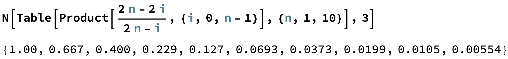
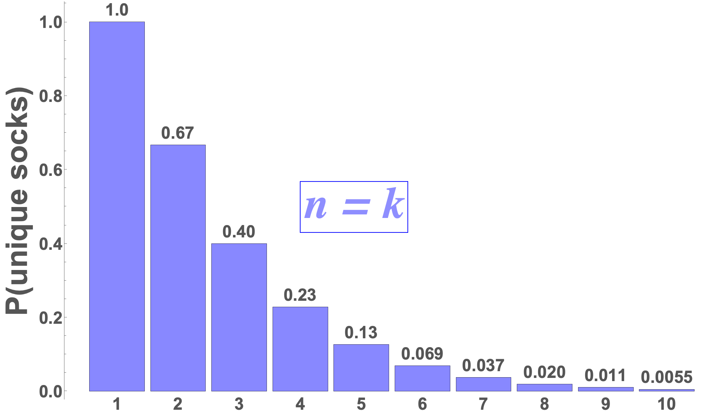
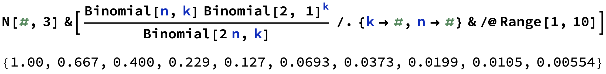
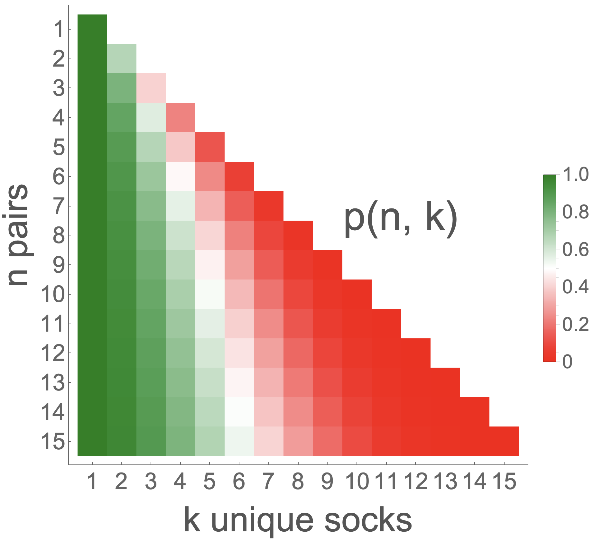

# Introduction

Probability pops up everywhere! One day, I was digging in a basket of (clean) clothes in search of socks pulling several of them out one by one. However, I pulled six socks out but none of them matched! I thought to myself: what the heck is the probability of THAT happening? So let's dig into how one might figure this out. But before we start answering this, let's be more clear about what the situation is.

Consider $n$ pairs of socks randomly scattered in a pile of laundry. You pull $k$ socks out to find out that they are all unmatched. **What is the probability of this happening?**

With these kinds of problems, one might wonder whether the socks, for example, are being pulled out one by one or if all the socks are selected simultaneously. Are these the same thing? Spoiler Alert: they are. But I want to show you two different ways you can approach this problem which emphasize these two ideas and show that they do indeed give the same answer!

-------------------------

# Pulling Socks One-by-One

### Choosing 3 Socks from 3 Pairs
* For clarity, let's assume there are 3 pairs of socks and we're choosing 3 individual socks one by one.
* We have to think about this as literal as possible so when there are no socks in your hand, we have to choose one. What is the probability of choosing a single sock? Well, it's $100\\%$. Of course it is!
* The real magic happens when the second sock is chosen. What is the probability of choosing a sock given that it's not similar to one you previously chose?
* Well you have $(2 \cdot n - 1)$ socks left to choose from but only $(2 \cdot n - 2)$ of them are *valid* (i.e., non-matching). So this conditional probability for the second sock becomes:
$$\frac{2\cdot n - 2}{2\cdot n - 1}$$
* We want to generalize this a bit so let's say that the first sock we chose was sock zero $(i = 0)$ and the second sock we chose was sock one $(i = 1)$. We will continue this pattern with the $i^{th}$ sock.
* With this notation we can rewrite the probability for the first and second sock $(i = 0\text{ and }i = 1)$ as:
$$P_{i\text{ = }0} = 1$$
$$P_{i\text{ = }1} = \frac{2\cdot n - 2\cdot i}{2\cdot n - i} = \frac{2\cdot 3 - 2\cdot 1}{2\cdot 3 - 1} = \frac{4}{5}$$
* So for the third sock $(i = 2)$, we ask what is the probability of choosing a sock given that it doesn't match what you already have:
$$P_{i\text{ = }2} = \frac{2\cdot n - 2\cdot i}{2\cdot n - i} = \frac{2\cdot 3 - 2\cdot 2}{2\cdot 3 - 2} = \frac{1}{2}$$
* Finally, to end this "three socks/three pairs" example, we'll just multiply all these individual probabilities together to get a final probability! The probability of choosing three socks from three pairs such that none of them match is:
$$P_{i\text{ = }0} \cdot P_{i\text{ = }1} \cdot P_{i\text{ = }2} = 1 \cdot \frac{4}{5} \cdot \frac{1}{2} = 0.40 = 40\\%$$

### Generalizing One-by-One Sock Pulling
* Let's generalize this solution by saying that we have $n$ pairs of socks in a basket and we're choosing $k$ individual socks one by one. The probability that all $k$ of the chosen socks are unique is:
$$P = \prod^{k - 1 \le n - 1}_{i\text{ = }0}\frac{2\cdot n - 2\cdot i}{2\cdot n - i}$$
* The $(k - 1 \le n - 1)$ is just to guarantee that we're able to actually have unmatched socks. If we choose too many socks (i.e., more than the number of pairs), we will HAVE to choose a matching pair (and we don't like matching socks).
* Let push our luck a bit. Say that the number of socks we choose ($k$) is always equal to the number of pairs ($n$) that are in the basket. I say that this is pushing our luck because the probability of having $k = n$ unique socks is the lowest (this is the largest $k$ that we are allowed to choose). If this doesn't make sense, take a minute to think about this. Just like in life, it's less likely for things to go our way when we ask for too much.
* Now we can easily compute probabilities for several $n=k$ values!
* For example, when there are 7 pairs of socks, the probabilities of chosen 7 single socks and them all being unique (i.e., non-matching) is about $3.73\\%$.


```python
from functools import reduce

probabilities = [reduce((lambda x, y: x * y), [(2*n - 2*i) / (2*n - i) for i in range(n)]) for n in range(1,11)]
list(zip([n for n in range(1, 11)], probabilities))
```


    [(1, 1.0),
     (2, 0.6666666666666666),
     (3, 0.4),
     (4, 0.22857142857142856),
     (5, 0.12698412698412698),
     (6, 0.06926406926406926),
     (7, 0.037296037296037296),
     (8, 0.01989121989121989),
     (9, 0.010530645824763473),
     (10, 0.0055424451709281414)]


* We can also plug this into Mathematica using the Wolfram Language!



* Mathematica also has great graphing capabilities!



# Choosing Socks Simultaneously

* We could think of this problem slightly differently. That is, we can imagine choosing several socks at the same time and this would technically be the same situation as choosing socks one-by-one.
* There are two main components we need to construct a probability: (1) The number of ways that a specific event can occur and (2) the total number of ways that any event can occur.
* In our example, this translates into (1) the number of ways that we can achieve non-matching socks given $n$ and $k$ and (2) the total number of ways that $k$ socks can be chosen from $n$ pairs.
* To begin, let's start with the later. The number of ways that $k$ socks can be chosen from $n$ pairs (regardless of socks matching or not) is $2n \choose k$:
$${2n \choose k} = \frac{(2n)!}{k! (2n - k)!}$$
* On the other hand, the number of ways that we can choose $k$ ***unique*** socks from $n$ pairs is:
$${n \choose k}{2 \choose 1}^k$$
* The ${n \choose k}$ term is the act of choosing $k$ pairs and the ${2 \choose 1}^k$ term is the act of choosing 1 sock (out of two) from each of those $k$ pairs.
* To put it all together, the final probability expression that we're after is:
$$P = \frac{{n \choose k}{2 \choose 1}^k}{2n \choose k}$$
* Let's show that this is indeed the same thing in Mathematica!



# Generalization $\forall k \le n$ $(n, k > 0)$

* Here we will further show that one-by-one and simultaneous sock pulling are indeed the same, not only when $n = k$ but for any $k \le n$. Remember that $n$ is the number of pairs to choose from and $k$ are the number of individual socks that are chosen.
* Recall that the two expressions that we derived above are:
$$
\begin{align}
  P_A &= \prod^{k - 1 \le n - 1}_{i\text{ = }0}\frac{2\cdot n - 2\cdot i}{2\cdot n - i} &\text{One-by-One} \\\\\\
  P_B &= \frac{{n \choose k}{2 \choose 1}^k}{2n \choose k} &\text{Simultaneous}
\end{align}
$$

* We can start with the first expression and do some rewriting:
$$
P_A = \prod^{k - 1 \le n - 1}_{i\text{ = }0}\frac{2\cdot n - 2\cdot i}{2\cdot n - i} = 2^k \prod^{k - 1 \le n - 1}\_{i\text{ = }0}\frac{n - i}{2\cdot n - i}
$$

* The numerator and denominator of $P_A$ becomes:

$$\text{Numerator} \rightarrow \prod^{k - 1 \le n - 1}_{i\text{ = }0}(n - i)\text{ = }\frac{n!}{(n - k)!}$$

$$\text{Denominator} \rightarrow \prod^{k - 1 \le n - 1}_{i\text{ = }0}(2n - i)\text{ = }\frac{(2n)!}{(2n - k)!}$$

<!-- $$
\begin{align}
    \prod^{k - 1 \le n - 1}\_{i\text{ = }0}(n - i) &= \frac{n!}{(n - k)!} &\text{Numerator} \\\\\\
    \prod^{k - 1 \le n - 1}\_{i\text{ = }0}(2n - i) &= \frac{(2n)!}{(2n - k)!} &\text{Denominator}
\end{align}
$$ -->

* Putting it all together for $P_A$, we get the following:
$$P_A = 2^k \prod^{k - 1 \le n - 1}_{i\text{ = }0}\frac{n - i}{2\cdot n - i} = 2^k \cdot \frac{\frac{n!}{(n - k)!}}{\frac{(2n)!}{(2n - k)!}} = 2^k \cdot \frac{n! \cdot (2n - k)!}{(2n)! \cdot (n - k)!}$$
* Now if we expand $P_B$ in terms of factorials we get the same expression:
$$P_B = \frac{{n \choose k}{2 \choose 1}^k}{2n \choose k} = 2^k \cdot \frac{\frac{n!}{k! (n - k)!}}{\frac{(2n)!}{k! (2n - k)!}} = 2^k \cdot \frac{n! \cdot (2n - k)!}{(2n)! \cdot (n - k)!}$$
* We can see that these are the same expression!
$$\therefore P_A = P_B$$
* We can now use this expression to show the probability distribution over these two parameters $n$ and $k$:



# Simulation

* We can trust the math especially since we got to the same result with two different approaches. However, it never hurts to create a simulation of the situation.
* Let's choose reasonable values for $n$ and $k$: $n = k = 4$.
* The question becomes: what is the probability of choosing 4 unique socks given that there are 4 pairs in the basket?

### Creating basket of paired socks


```python
import random

def create_basket(n):
    basket = 2*[i for i in range(n)]
    random.shuffle(basket)
    return basket
```

### Choosing $k$ socks


```python
def select_socks(basket, k):
    return [basket.pop(0) for _ in range(k)]
```

### Check if at least one pair exists in `selection`


```python
def repeats(selected_socks):
    seen = set()
    for s in selected_socks:
        if s in seen:
            return True
        seen.add(s)
    return False
```

### Run simulation many times


```python
many_times = 1000
n = k = 4
results = []

for _ in range(many_times):
    basket = create_basket(n)
    selection = select_socks(basket, k)
    results.append(0 if repeats(selection) else 1)
```

### Calculating probability of unique socks in selection


```python
p = sum(results)/len(results)
print(f'Probability of choosing {k} socks from {n} pairs is: {p*100}%')
```

    Probability of choosing 4 socks from 4 pairs is: 22.900000000000002%


### Compare this number to the `0.22857142857142856` —— we should be pretty close!
